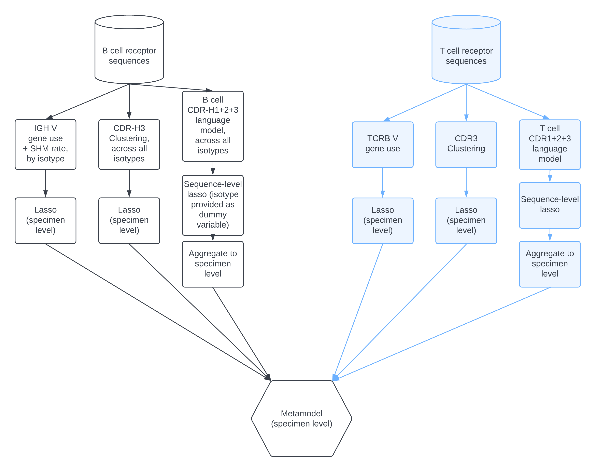

# Mal-ID [](https://codecov.io/gh/maximz/malid)

**Preprint**: [Disease diagnostics using machine learning of immune receptors](https://www.biorxiv.org/content/10.1101/2022.04.26.489314v3)

## Install

### GPU conda environment setup (skip if CPU virtualenv only)

```bash
# Install mamba to replace conda
conda install mamba -n base -c conda-forge

# Create env
mamba create -f environment.yml

# Activate env
conda activate cuda-env-py39
which nvcc # ~/anaconda3/envs/cuda-env-py39/bin/nvcc
nvcc --version # Cuda compilation tools, release 11.5, V11.5.119

```

Add this to `~/.bashrc`:

```bash
# Turn off Jax GPU memory preallocation
# Without this, Jax fills up the GPU completely and isn't cleared. Then any use of non-Jax GPU libraries will fail because GPU memory is full.
# See https://jax.readthedocs.io/en/latest/gpu_memory_allocation.html and https://github.com/google/jax/issues/1222
export XLA_PYTHON_CLIENT_PREALLOCATE=false
export XLA_PYTHON_CLIENT_ALLOCATOR=platform

# Solve Jax CUDA problem:
# external/org_tensorflow/tensorflow/stream_executor/cuda/cuda_asm_compiler.cc:57] cuLinkAddData fails. This is usually caused by stale driver version.
# external/org_tensorflow/tensorflow/compiler/xla/service/gpu/gpu_compiler.cc:1320] The CUDA linking API did not work. Please use XLA_FLAGS=--xla_gpu_force_compilation_parallelism=1 to bypass it, but expect to get longer compilation time due to the lack of multi-threading.
# jaxlib.xla_extension.XlaRuntimeError: UNKNOWN: no kernel image is available for execution on the device
# see https://github.com/google/jax/issues/5723
export XLA_FLAGS="--xla_gpu_force_compilation_parallelism=1"
```

Apply:

```bash
source ~/.bashrc
conda activate cuda-env-py39
```

### Install requirements

```bash
pip install --upgrade pip wheel

# General requirements (clone github repos into a sibling directory):
mkdir -p ../cuda-env-py39-pkgs
pip install -r requirements.txt --src ../cuda-env-py39-pkgs

# GPU specific requirements (skip if CPU only):
pip install -r requirements_gpu.txt --src ../cuda-env-py39-pkgs

# Or if running on CPU only:
# pip install -r requirements_cpu.txt --src ../cuda-env-py39-pkgs

# Further general requirements that rely on the CPU/GPU-specific requirements being installed:
pip install -r requirements_extra.txt --src ../cuda-env-py39-pkgs

pip check
## Ignore cupy-cuda115 - handled by cupy conda:
# dask-cudf 22.4.0 requires cupy-cuda115, which is not installed.
# cudf 22.4.0 requires cupy-cuda115, which is not installed.
## Not sure if this is going to be an issue:
# dask-cudf 22.4.0 has requirement pandas<1.4.0dev0,>=1.0, but you have pandas 1.4.3.
# cudf 22.4.0 has requirement pandas<1.4.0dev0,>=1.0, but you have pandas 1.4.3.
## Ignore this one - we deliberately upgraded dask version in pip beyond what was installed through conda with rapidsai (rapidsai overall version is constrained by protobuf version, which is constrained by tensorflow):
# dask-cudf 22.4.0 has requirement dask==2022.03.0, but you have dask 2022.6.1.
# dask-cudf 22.4.0 has requirement distributed==2022.03.0, but you have distributed 2022.6.1.
# dask-cuda 22.4.0 has requirement dask==2022.03.0, but you have dask 2022.6.1.
# dask-cuda 22.4.0 has requirement distributed==2022.03.0, but you have distributed 2022.6.1.

# Add kernel to system-wide jupyter notebook
ipython kernel install --name py39-cuda-env --user
# Installed kernelspec py39-cuda-env in ~/.local/share/jupyter/kernels/py39-cuda-env

# download PyIR reference data
pyir setup

# install local package
pip install -e .

# install local fonts
cp /mnt/lab_data/kundaje/projects/malid/fonts/*.ttf $HOME/anaconda3/envs/cuda-env-py39/lib/python3.9/site-packages/matplotlib/mpl-data/fonts/ttf
python -c 'import matplotlib.font_manager; matplotlib.font_manager._load_fontmanager(try_read_cache=False)'

# Run all tests
pytest tests/test_dependencies.py # confirm core dependencies properly installed
pytest
pytest --gpu # unless CPU only

# Install pre-commit (see Development section below)
conda deactivate
pre-commit install

# Snapshot resulting conda environment (unless CPU virtualenv):
conda env export --name cuda-env-py39 --no-builds | grep -v "prefix" > cudaenv.conda.yml

# If needed, here is how to delete an env we no longer use:
# conda deactivate
# rm -r ~/anaconda3/envs/cuda-env-py39
```

If we have upgraded from an older version by creating a new environment, change all notebooks and scripts to use that kernel (note this will also modify this readme):

```bash
## Edit with recursive sed:
# jupyter (kernel name)
grep -rl "py37-cuda-env" . --exclude-dir=.git | xargs sed -i "" -e 's/py37-cuda-env/py39-cuda-env/g'

# scripts (conda env name)
grep -rl "cuda-env-py37" . --exclude-dir=.git | xargs sed -i "" -e 's/cuda-env-py37/cuda-env-py39/g'
```

### Install R kernel too

```bash
conda create -n r-v41
conda activate r-v41

mamba install -c conda-forge r-recommended=4.1 r-irkernel=1.3 -y;
R --version # 4.1.3
Rscript --version # 4.1.3

mamba install -c conda-forge Jupyter -y;
# Fix zmq import error:
pip uninstall pyzmq
pip install pyzmq
# Register kernel
R -e 'IRkernel::installspec(name = "ir41", displayname = "R 4.1", user = TRUE)'
# Note remaining pip error: "jupyter 1.0.0 requires qtconsole, which is not installed."

# Install packages
R -e 'install.packages("tidyverse",repos = "http://cran.us.r-project.org")'
# ERROR: dependencies ‘googledrive’, ‘googlesheets4’, ‘reprex’ are not available for package ‘tidyverse’
R -e 'install.packages("gridExtra", repos = "http://cran.us.r-project.org")'

conda deactivate
jupyter kernelspec list
#   ir41                 /users/maximz/.local/share/jupyter/kernels/ir41
```


## Environment setup and everyday use

```bash
conda activate cuda-env-py39

## first time setup:
pre-commit install
# install package
pip install -e .
# only test that core dependencies are installed
pytest tests/test_dependencies.py

## everyday use:

# lint all files
make lint
# or lint staged files only
make lint-staged
# or lint files that have changed since upstream only
make lint-diff

# Run all tests with GPU disabled, skipping any tests marked with @pytest.mark.gpu
pytest # or simply: make test

# Run all tests with GPU enabled, including any tests marked with @pytest.mark.gpu, but skipping any tests marked @pytest.mark.skip_if_gpu.
pytest --gpu

# You can further narrow down the tests to CPU and fast ones only (for CI):
pytest -m "not slow"

# recreate all jupytext generated scripts
make regen-jupytext

# add this to .bashrc to log to Sentry:
# export SENTRY_API_KEY='https://REDACTED.ingest.sentry.io/REDACTED'
```

Logs are written to `paths.log_dir` from `config.py`.

When writing tests, don't call `config.configure_gpu()` manually. That's handled automatically by the test setup logic in `conftest.py` based on whether you run `pytest` or `pytest --gpu`.

Any tests that require GPU should be decorated with `@pytest.mark.gpu`. Any tests that are to be run with CPU only, and skipped if GPU is active, should be decorated with `@pytest.mark.skip_if_gpu`.

### Jupytext mirroring

Using jupytext, every `.ipynb` notebook in `notebooks/` has a paired `.py` script in `notebooks_src/`. This makes diffs much cleaner (nbdiff/nbdime is too slow and finnicky to be practical) and allows for bulk refactoring.

When you edit and save the `.ipynb` notebook in Jupyter Lab, Jupytext updates the `.py` paired script automatically. And when you edit the `.py` script in a text editor, reloading the paired `.ipynb` notebook in Jupyter Lab will sync the updates to the notebook.

Sometimes we fall back to the command line to sync these notebook/script pairs: after editing either element of the pair, you can `git add` it to the git staging area and then `make lint-staged` to run jupytext-sync (and other pre-commit hooks) on all staged files. We tend to do this after bulk refactors of `.py` scripts (`make lint-staged` will update the paired notebooks without having to open each one in Jupyter Lab) or after auto-generating notebooks from other template notebooks with `run_notebook_to_new_file.sh` (`make lint-staged` will then generate or update the paired script.)

### Best practices

I tend to work in feature branches with pull requests against master, until they're mature and pass all tests.

I tend to make microcommits with `git commit --fixup HEAD` (or use a commit hash from `git log` instead of `HEAD`).

When a branch is ready to merge, I squash those fixup commits into their parent:

```bash
git push origin my-branch-name # store a copy on origin (github) to be safe
git rebase -i origin/master --autosquash
git diff origin/my-branch-name..HEAD # should be empty / silent - confirm the rebase didn't change anything
```

To pull new changes from master into your feature branch:

```bash
git push origin my-branch-name # to be safe, backup your branch on origin (github)
git fetch --all
git rebase -i origin/master
```

You can analyze what the rebase did with commands like:

```bash
# compare [old master to old HEAD] to [new master to new HEAD]
diff <(git log master..origin/my-branch-name -p) <(git log origin/master..HEAD -p) | less
# or
git range-diff @{u} @{1} @
```

When ready: `git push --force origin my-branch-name` to save your changes to the Github copy too.

## Configuration

### Modeling feature flags

In `config.py`:

- `default_embedder`: language model to use. Or override with `EMBEDDER_TYPE` environment variable, which accepts `name` property values from any embedder.
- `classification_targets`
- `sequence_identity_thresholds` (for model2)
- `gene_loci_used` (include BCR, TCR, or both)
- `metamodel_base_model_names` (base model versions used in metamodel)

### Configure file paths

View current path configuration: `./config.py`

Update `config.py`. For each file path, `rm -r FILEPATH` it if we are regenerating.

To create all the necessary directories (including intermediates -- this is like `mkdir -p`): run `python scripts/make_dirs.py`

### Configure diseases

To add new diseases, modify:

- `etl.ipynb`
- `helpers.py`'s disease list
- `rm -r out && mkdir -p out`
- `config.py`'s `subtypes_keep`, `diseases_to_keep_all_subtypes`, and `immunodeficiency_diseases`
- `datamodels.TargetObsColumnEnum` and `config.classification_targets`
- `config.py`'s `dataset_version`, then run `python scripts/make_dirs.py`

## Design

### Sequence data

Raw sequences are stored in Parquet format. We must be consistent about which conserved prefixes/suffixes to the CDR regions are kept or removed. We use IgBlast-formatted CDR1/2/3 regions from IMGT numbering. V3-30 example:

- CDR1: `GFTFSSYG`
- CDR2: `ISYDGSNK`
- CDR3: `ARDGIVGATGLDY`, `AKEMFKYGSGVSSDGFDV`, etc. Notice the leading `C` and trailing `W` are removed.

Our TCR data is missing CDR1 and CDR2 annotations. But these are deterministic since TCRs don't have somatic hypermutations. We fill in the CDR1 and CDR2 regions using downloaded reference sequences.

### Embeddings

Embedded sequence vectors coming from a language model are stored in AnnData objects as `.X`, with metadata in `.obs`.

BCR and TCR sequences are stored together in Parquet, but pass through separate language model embeddings and land in separate AnnData objects. This is because the two types of sequences are selected to bind to different targets (antibodies can bind almost any epitope structure, whereas TCRs bind peptides in the context of MHC). We expect correlations within BCRs and correlations within TCRs, not between the two.

These AnnData objects are further divided by cross validation folds: `fold_id` can be 0, 1, or 2, and `fold_label` can be `train_smaller`, `validation`, or `test`. There's also a special `fold_id=-1` "global" fold that does not have a `test` set. The data is instead used in the other two fold labels; the `train_smaller` to `validation` proportion is the same as for other fold IDs, but both sets are larger than usual.

### Models

We train all the models using the AnnData objects divided into cross validation folds. (We do this so that all models get exactly the same sets of sequences - even though some models will ignore `.X` and only use `.obs`.)




## Runbook, for a single embedder

### ETL and first embedding

This will use default_embedder from `config.py`. The first ETL steps are not embedder-specific.

```bash
# rm -r and mkdir -p the config.py paths

conda activate cuda-env-py39;

python scripts/make_dirs.py

## Preparation
# extract TCR-B reference annotations
python scripts/get_tcr_v_gene_annotations.py;

## ETL: Boydlab data
# ETL output is not embedding type-specific, so it's just written to `out/`, rather than an embedding type-specific subdirectory.

./run_notebooks.sh \
    notebooks/etl.ipynb \
    notebooks/participant_specimen_disease_map.ipynb \
    notebooks/read_counts_per_specimen.ipynb \
    notebooks/get_all_v_genes.ipynb; # generates a list of all observed V genes in our dataset so we can add V gene dummy variables to our models

############

# Sample sequences
./run_notebooks.sh notebooks/sample_sequences.ipynb;


## Make CV splits, subsetting to "peak" dataset only (as defined in config.py):
# (We will use second-stage blending meta-model -- requires splitting training set into train-smaller + validation sets)
./run_notebooks.sh notebooks/make_cv_folds.ipynb;
```

### Fine-tuning

Fine tune UniRep separately for each fold, using a subset of train-smaller set (choosing the training epoch with best performance against a subset of validation set).

```bash
# now change config.py to have embedder be "unirep_fine_tuned"

# then make the directories:
python scripts/make_dirs.py

# Run fine-tuning with CDR123 and CDR3 only:
# python scripts/fine_tune_unirep.py # Run them all
# You can also override --num_epochs, which defaults to 40.
# Split up between machines:
python scripts/fine_tune_unirep.py --locus BCR --fold_id 0 2>&1 | tee "data/logs/fine_tune_unirep.fold0.bcr.log"
python scripts/fine_tune_unirep.py --locus TCR --fold_id 0 2>&1 | tee "data/logs/fine_tune_unirep.fold0.tcr.log"
#
python scripts/fine_tune_unirep.py --locus BCR --fold_id 1 2>&1 | tee "data/logs/fine_tune_unirep.fold1.bcr.log"
python scripts/fine_tune_unirep.py --locus TCR --fold_id 1 2>&1 | tee "data/logs/fine_tune_unirep.fold1.tcr.log"
#
python scripts/fine_tune_unirep.py --locus BCR --fold_id 2 2>&1 | tee "data/logs/fine_tune_unirep.fold2.bcr.log"
python scripts/fine_tune_unirep.py --locus TCR --fold_id 2 2>&1 | tee "data/logs/fine_tune_unirep.fold2.tcr.log"

python scripts/fine_tune_unirep.py --locus BCR --fold_id -1 2>&1 | tee "data/logs/fine_tune_unirep.globalfold.bcr.log"
python scripts/fine_tune_unirep.py --locus TCR --fold_id -1 2>&1 | tee "data/logs/fine_tune_unirep.globalfold.tcr.log"

# Extract parameters at epoch with best validation loss:
./run_notebooks.sh notebooks/fine_tune.analyze_over_epochs.ipynb;


# Fetch uniref 50 raw data
wget -O - https://ftp.uniprot.org/pub/databases/uniprot/uniref/uniref50/README # print readme to describe uniref data
wget -O ./data/uniref50.fasta.gz  https://ftp.uniprot.org/pub/databases/uniprot/uniref/uniref50/uniref50.fasta.gz # download ref data
! zcat ./data/uniref50.fasta.gz | echo $((`wc -l`/4)) # 83360861 total sequences

# Assess perplexity/cross validation loss on uniref50 + TCR/BCR sequences
./run_notebooks.sh notebooks/catastrophic_forgetting.ipynb;


## Run CDR1+2+3 embedding with this fine-tuned language model. Then scale resulting anndatas.

# Run on all folds and loci:
# python scripts/run_embedding.fine_tuned.py # (TODO: Reenable running non-fine-tuned version)
# python scripts/scale_anndatas_created_with_finetuned_embedding.py

# OR split up between machines:
python scripts/run_embedding.fine_tuned.py --locus BCR --fold_id 0 2>&1 | tee "data/logs/run_embedding.fine_tuned.fold0.bcr.log"
python scripts/scale_anndatas_created_with_finetuned_embedding.py --locus BCR --fold_id 0 2>&1 | tee "data/logs/scale_anndatas_created_with_finetuned_embedding.fold0.bcr.log"

python scripts/run_embedding.fine_tuned.py --locus TCR --fold_id 0 2>&1 | tee "data/logs/run_embedding.fine_tuned.fold0.tcr.log"
python scripts/scale_anndatas_created_with_finetuned_embedding.py --locus TCR --fold_id 0 2>&1 | tee "data/logs/scale_anndatas_created_with_finetuned_embedding.fold0.tcr.log"

#

python scripts/run_embedding.fine_tuned.py --locus BCR --fold_id 1 2>&1 | tee "data/logs/run_embedding.fine_tuned.fold1.bcr.log"
python scripts/scale_anndatas_created_with_finetuned_embedding.py --locus BCR --fold_id 1 2>&1 | tee "data/logs/scale_anndatas_created_with_finetuned_embedding.fold1.bcr.log"

python scripts/run_embedding.fine_tuned.py --locus TCR --fold_id 1 2>&1 | tee "data/logs/run_embedding.fine_tuned.fold1.tcr.log"
python scripts/scale_anndatas_created_with_finetuned_embedding.py --locus TCR --fold_id 1 2>&1 | tee "data/logs/scale_anndatas_created_with_finetuned_embedding.fold1.tcr.log"

#

python scripts/run_embedding.fine_tuned.py --locus BCR --fold_id 2 2>&1 | tee "data/logs/run_embedding.fine_tuned.fold2.bcr.log"
python scripts/scale_anndatas_created_with_finetuned_embedding.py --locus BCR --fold_id 2 2>&1 | tee "data/logs/scale_anndatas_created_with_finetuned_embedding.fold2.bcr.log"

python scripts/run_embedding.fine_tuned.py --locus TCR --fold_id 2 2>&1 | tee "data/logs/run_embedding.fine_tuned.fold2.tcr.log"
python scripts/scale_anndatas_created_with_finetuned_embedding.py --locus TCR --fold_id 2 2>&1 | tee "data/logs/scale_anndatas_created_with_finetuned_embedding.fold2.tcr.log"

#

python scripts/run_embedding.fine_tuned.py --locus BCR --fold_id -1 2>&1 | tee "data/logs/run_embedding.fine_tuned.globalfold.bcr.log"
python scripts/scale_anndatas_created_with_finetuned_embedding.py --locus BCR --fold_id -1 2>&1 | tee "data/logs/scale_anndatas_created_with_finetuned_embedding.globalfold.bcr.log"

python scripts/run_embedding.fine_tuned.py --locus TCR --fold_id -1 2>&1 | tee "data/logs/run_embedding.fine_tuned.globalfold.tcr.log"
python scripts/scale_anndatas_created_with_finetuned_embedding.py --locus TCR --fold_id -1 2>&1 | tee "data/logs/scale_anndatas_created_with_finetuned_embedding.globalfold.tcr.log"
```

### Train and analyze models

```bash
## Generate isotype proportion counts per specimen. This is loaded as metadata by helpers.py when running all models below.
./run_notebooks.sh notebooks/isotype_stats.ipynb;

################


## Model 1: Repertoire statistics classifiers, for Healthy-vs-Sick classification:
# Compute repertoire-level statistics, then run classifiers on them, using same fold splits as in modeling above.
# Train new repertoire stats model on train_smaller too, first evaluating on validation set, then evaluating on test set (with and without tuning on validation set)
# Feature standardization is built-in.
python scripts/train_repertoire_stats_models.py 2>&1 | tee "data/logs/train_repertoire_stats_models.log";
./run_notebooks.sh \
    notebooks/analyze_repertoire_stats_models.ipynb \
    notebooks/repertoire_stats_classifiers.tune_model_decision_thresholds_on_validation_set.ipynb \
    notebooks/summary.repertoire_stats_classifiers.ipynb \
    notebooks/interpret_model1.ipynb;

## Model 2: Convergent sequence cluster classifiers for disease classification
# Run convergent clustering classifiers on train-smaller too, so that comparable to our models above, along with tuning on validation set.
# train on all folds, loci, and targets
# or pass in specific settings, see: python scripts/train_convergent_clustering_models.py --help
# for example: python scripts/train_convergent_clustering_models.py --target_obs_column "disease" --n_jobs 8
# note that --n_jobs here corresponds to the parallelization level for p-value threshold tuning
python scripts/train_convergent_clustering_models.py --n_jobs 8 2>&1 | tee "data/logs/train_convergent_clustering_models.log";
./run_notebooks.sh \
    notebooks/analyze_convergent_clustering_models.ipynb \
    notebooks/convergent_clustering_models.tune_model_decision_thresholds_on_validation_set.ipynb \
    notebooks/summary.convergent_sequence_clusters.ipynb;

## Benchmark: Exact matches classifier.
# Train on disease only.
# note that --n_jobs here corresponds to the parallelization level for p-value threshold tuning
python scripts/train_exact_matches_models.py --target_obs_column "disease" --n_jobs 8 2>&1 | tee "data/logs/train_exact_matches_models.log";
./run_notebooks.sh notebooks/analyze_exact_matches_models.ipynb;

## Model 3:
# Train all-noisy-labels language model classifiers on training set with validation set removed
python scripts/train_sequence_model.py --help;
# Split targets into separate jobs on different machines:
for TARGET_OBS_COLUMN in $(python scripts/target_obs_column_names.py)
do
    echo "python scripts/train_sequence_model.py --target_obs_column \"$TARGET_OBS_COLUMN\" 2>&1 | tee \"data/logs/train_sequence_model.$TARGET_OBS_COLUMN.log\""
done
unset TARGET_OBS_COLUMN;

# This generates e.g.:
# python scripts/train_sequence_model.py --target_obs_column "disease" 2>&1 | tee "data/logs/train_sequence_model.disease.log"
# python scripts/train_sequence_model.py --target_obs_column "disease_all_demographics_present" 2>&1 | tee "data/logs/train_sequence_model.disease_all_demographics_present.log"
# python scripts/train_sequence_model.py --target_obs_column "ethnicity_condensed_healthy_only" 2>&1 | tee "data/logs/train_sequence_model.ethnicity_condensed_healthy_only.log"
# python scripts/train_sequence_model.py --target_obs_column "age_group_healthy_only" 2>&1 | tee "data/logs/train_sequence_model.age_group_healthy_only.log"
# python scripts/train_sequence_model.py --target_obs_column "age_group_binary_healthy_only" 2>&1 | tee "data/logs/train_sequence_model.age_group_binary_healthy_only.log"
# python scripts/train_sequence_model.py --target_obs_column "sex_healthy_only" 2>&1 | tee "data/logs/train_sequence_model.sex_healthy_only.log"

# Here's how that scripts works:
# - If no `--target_obs_column` is supplied, it trains on all target_obs_columns one by one. You can supply multiple `--target_obs_column` values.
# - Same for `--fold_id` and `--locus`.

# This means you can mix and match across machines, e.g.:
# python scripts/train_sequence_model.py \
#     --target_obs_column "disease" \
#     --target_obs_column "disease_all_demographics_present" \
#     --fold_id 1 \
#     2>&1 | tee "data/logs/train_sequence_model.disease.disease_all_demographics_present.fold1.log";
# python scripts/train_sequence_model.py \
#     --target_obs_column "disease" \
#     --target_obs_column "disease_all_demographics_present" \
#     --fold_id 2 \
#     2>&1 | tee "data/logs/train_sequence_model.disease.disease_all_demographics_present.fold2.log";
# python scripts/train_sequence_model.py \
#     --target_obs_column "age_group_binary_healthy_only" \
#     --target_obs_column "sex_healthy_only" \
#     2>&1 | tee "data/logs/train_sequence_model.age_group_binary_healthy_only.sex_healthy_only.log";
# python scripts/train_sequence_model.py \
#     --target_obs_column "ethnicity_condensed_healthy_only" \
#     --target_obs_column "age_group_healthy_only" \
#     --fold_id 1 --fold_id 2 \
#     2>&1 | tee "data/logs/train_sequence_model.ethnicity_condensed_healthy_only.age_group_healthy_only.fold1.fold2.log";

# Final example: if you just want to run the "disease" target (see also config.classification_targets setting), but split up loci and fold IDs, here's how you could parallelize that across machines:
python scripts/train_sequence_model.py \
    --target_obs_column "disease" \
    --locus BCR \
    --fold_id 0 \
     2>&1 | tee "data/logs/train_sequence_model.disease.fold0.bcr.log";
python scripts/train_sequence_model.py \
    --target_obs_column "disease" \
    --locus TCR \
    --fold_id 0 \
     2>&1 | tee "data/logs/train_sequence_model.disease.fold0.tcr.log";
#
python scripts/train_sequence_model.py \
    --target_obs_column "disease" \
    --locus BCR \
    --fold_id 1 \
     2>&1 | tee "data/logs/train_sequence_model.disease.fold1.bcr.log";
python scripts/train_sequence_model.py \
    --target_obs_column "disease" \
    --locus TCR \
    --fold_id 1 \
     2>&1 | tee "data/logs/train_sequence_model.disease.fold1.tcr.log";
#
python scripts/train_sequence_model.py \
    --target_obs_column "disease" \
    --locus BCR \
    --fold_id 2 \
     2>&1 | tee "data/logs/train_sequence_model.disease.fold2.bcr.log";
python scripts/train_sequence_model.py \
    --target_obs_column "disease" \
    --locus TCR \
    --fold_id 2 \
     2>&1 | tee "data/logs/train_sequence_model.disease.fold2.tcr.log";
#
python scripts/train_sequence_model.py \
    --target_obs_column "disease" \
    --locus BCR \
    --fold_id -1 \
     2>&1 | tee "data/logs/train_sequence_model.disease.globalfold.bcr.log";
python scripts/train_sequence_model.py \
    --target_obs_column "disease" \
    --locus TCR \
    --fold_id -1 \
     2>&1 | tee "data/logs/train_sequence_model.disease.globalfold.tcr.log";


## Model 3, analyze:
./run_notebooks.sh notebooks/analyze_sequence_model.ipynb;
# This script accepts target obs column and other similar arguments:
python scripts/rollup_sequence_classifier_to_specimen_level.py 2>&1 | tee "data/logs/rollup_sequence_classifier_to_specimen_level.log";
./run_notebooks.sh \
    notebooks/sequence_classifier_rollup_strategy.ipynb \
    notebooks/model3rollup_add_abstentions_to_compare_to_model2.ipynb \
    notebooks/summary.model3.ipynb;

# Now train second-stage blending model using base models trained on train-smaller
# Later, consider other variations where we use other sequence models besides lasso_multiclass, or try on all noisy labels with sequence weights
# train on all folds, loci, and targets
# or pass in specific settings, see: python scripts/train_metamodels.py --help
# for example: python scripts/train_metamodels.py --target_obs_column "disease"
python scripts/train_metamodels.py 2>&1 | tee "data/logs/train_metamodels.log";
./run_notebooks.sh \
    notebooks/analyze_metamodels.ipynb \
    notebooks/summary.metamodels.ipynb \
    notebooks/summary.metamodels.succinct.ipynb;

# Overall summary
./run_notebooks.sh notebooks/summary.ipynb;
```


### Analyze highly-ranked sequences and intersect with Cov-AbDab / MIRA

First process known binder datasets with our IgBlast version.

#### CoV-AbDab IgBlast

Unlike other datasets, we have amino acid entries (`VHorVHH` column). We need to switch to `igblastp` instead of the usual `igblastn`. The version of IgBlast we use predates the introduction of the AIRR output format, and the legacy parser doesn't support `igblastp`, so we have to roll our own parser too. Ultimately we get V gene calls and CDR1+2 sequences out of this, but use the original CDR3 sequence and J gene call from CoV-AbDab.

```bash
# Choose sequences of interest
./run_notebooks.sh notebooks/cov_abdab.ipynb;

# Export to fasta
python scripts/export_sequences_to_fasta.py \
    --input "data/CoV-AbDab_260722.filtered.tsv" \
    --output "data/CoV-AbDab_260722.filtered.fasta" \
    --name "covabdab" \
    --separator $'\t' \
    --column "VHorVHH";

# Move these to yellowblade:
mkdir -p /data/maxim/covabdab
cd /data/maxim/covabdab
scp 'maximz@nandi:code/malid/data/CoV-AbDab_260722.filtered.fasta' covabdab.fasta

# Chunk the fasta files.
# Use gnu split command because we know the fastas we generated always have each sequence on a single line, i.e. number of lines is divisible by two (not all fasta are like this!)
cd /data/maxim/covabdab
rm -r splits
mkdir -p splits
split -l 10000 --verbose --numeric-suffixes=1 --suffix-length=10 --additional-suffix=".fasta" "covabdab.fasta" "splits/covabdab.fasta.part"

# Install igblastp
# Download it from https://ftp.ncbi.nih.gov/blast/executables/igblast/release/1.3.0/ncbi-igblast-1.3.0-x64-linux.tar.gz

# Result:
$HOME/boydlab/igblast/igblastp -version
# igblastp: 1.0.0
# Package: igblast 1.3.0, build Mar 11 2014 10:16:49

# Matches version of:
$HOME/boydlab/igblast/igblastn -version
# igblastn: 1.0.0
# Package: igblast 1.3.0, build Mar 26 2014 14:46:28

# Run igblast
cp $HOME/boydlab/pipeline/run_igblastp_igh.sh .;
cp $HOME/boydlab/igblast/human_gl* .;
cp -r $HOME/boydlab/igblast/internal_data/ .;
# IN TMUX:
find splits -name "*.part*.fasta" | xargs -I {} -n 1 -P 55 sh -c "./run_igblastp_igh.sh {}"

# Monitor
find splits -name "*.part*.fasta" | wc -l
find splits -name "*.parse.txt" | wc -l

# Here's how to transfer this giant set of parses. Standard scp can fail with "argument list too long", but this works:
# For igblastp, we will also transfer the chunked fastas
rsync -a --include="*.part*.fasta" --exclude='*' splits/ maximz@nandi:code/malid/data/covabdab_igblast_splits/
rsync -a --include='*.parse.txt' --exclude='*' splits/ maximz@nandi:code/malid/data/covabdab_igblast_splits/

# Back to our python environment
for fname in data/covabdab_igblast_splits/*.part*.fasta; do
    echo $fname;
    python scripts/parse_igblastp.py \
        --fasta "$fname" \
        --parse "$fname.parse.txt" \
        --output "$fname.parsed.tsv" \
        --separator $'\t';
done

# Merge IgBlast parsed output to the original CoV-AbDab data
./run_notebooks.sh notebooks/covabdab_add_igblast_annotations.ipynb;
```

#### MIRA IgBlast

```bash
python scripts/export_sequences_to_fasta.py \
    --input "data/external_cohorts/raw_data/immunecode/mira/ImmuneCODE-MIRA-Release002.1/peptide-detail-ci.csv" \
    --output "data/external_cohorts/raw_data/immunecode/mira/ImmuneCODE-MIRA-Release002.1/peptide-detail-ci.fasta" \
    --name "peptide-detail-ci" \
    --column "TCR Nucleotide Sequence";

python scripts/export_sequences_to_fasta.py \
    --input "data/external_cohorts/raw_data/immunecode/mira/ImmuneCODE-MIRA-Release002.1/peptide-detail-cii.csv" \
    --output "data/external_cohorts/raw_data/immunecode/mira/ImmuneCODE-MIRA-Release002.1/peptide-detail-cii.fasta" \
    --name "peptide-detail-cii" \
    --column "TCR Nucleotide Sequence";

python scripts/export_sequences_to_fasta.py \
    --input "data/external_cohorts/raw_data/immunecode/mira/ImmuneCODE-MIRA-Release002.1/minigene-detail.csv" \
    --output "data/external_cohorts/raw_data/immunecode/mira/ImmuneCODE-MIRA-Release002.1/minigene-detail.fasta" \
    --name "minigene-detail" \
    --column "TCR Nucleotide Sequence";

# Move these to yellowblade:
mkdir -p /data/maxim/mira
cd /data/maxim/mira
scp 'maximz@nandi:code/malid/data/external_cohorts/raw_data/immunecode/mira/ImmuneCODE-MIRA-Release002.1/*.fasta' .

# Chunk the fasta files.
# Use gnu split command because we know the fastas we generated always have each sequence on a single line, i.e. number of lines is divisible by two (not all fasta are like this!)
cd /data/maxim/mira
rm -r splits
mkdir -p splits
for fname in *.fasta; do
  split -l 10000 --verbose --numeric-suffixes=1 --suffix-length=10 --additional-suffix=".fasta" "$fname" "splits/$fname.part"
done

# Run igblast
cp $HOME/boydlab/pipeline/run_igblast_command_tcr.sh .;
cp $HOME/boydlab/igblast/human_gl* .;
cp -r $HOME/boydlab/igblast/internal_data/ .;
# IN TMUX:
find splits -name "*.part*.fasta" | xargs -I {} -n 1 -P 55 sh -c "./run_igblast_command_tcr.sh {}"

# Monitor
find splits -name "*.part*.fasta" | wc -l
find splits -name "*.parse.txt" | wc -l

# Parse to file
# IN TMUX:
conda deactivate
source ~/boydlab/pyenv/activate
# $HOME/boydlab/pipeline/load_igblast_parse.ireceptor_data.to_file.py --locus TCRB splits/*.parse.txt
# parallelize in chunk size of 50 parses x 40 processes:
find splits -name "*.parse.txt" | xargs -x -n 50 -P 40 $HOME/boydlab/pipeline/load_igblast_parse.ireceptor_data.to_file.py --locus "TCRB"

# Monitor
find splits -name "*.parse.txt" | wc -l
find splits -name "*.parse.txt.parsed.tsv" | wc -l

# We will then join IgBlast parsed output to the original data in a notebook.

# Here's how to transfer this giant set of parses. Standard scp can fail with "argument list too long", but this works:
rsync -a --include='*.parse.txt.parsed.tsv' --exclude='*' splits/ maximz@nandi:code/malid/data/external_cohorts/raw_data/immunecode/mira/ImmuneCODE-MIRA-Release002.1/igblast_splits/
```

Merge IgBlast parsed output to the original data (for MIRA) and subset to sequences of interest:

```bash
./run_notebooks.sh notebooks/mira.ipynb;
```

#### Run analysis

```bash
./run_notebooks.sh \
    notebooks/sequence_model_interpretation.ipynb \
    notebooks/summary.sequence_model_interpretation.ipynb;

# Embed known binders:
./run_notebooks.sh notebooks/embed_known_binders.ipynb;

# Updated known-binder database comparison:
./run_notebooks.sh \
    notebooks/sequence_model_ranks_of_known_binders_vs_healthy_donor_sequences.ipynb \
    notebooks/model2_ranks_of_known_binders_vs_healthy_donor_sequences.ipynb \
    notebooks/exact_matches_model_which_sequences_are_chosen.ipynb \
    notebooks/summary.rankings_of_known_binders.ipynb;
```

### Wrap up confounders checks

Note that `vgene_usage_stats.ipynb` uses output from `sequence_model_interpretation.*.ipynb`.

```bash
./run_notebooks.sh \
    notebooks/vgene_usage_stats.ipynb \
    notebooks/size_of_each_disease_batch.ipynb \
    notebooks/confounder_model.ipynb \
    notebooks/summary.confounders.ipynb;

## Measure number of overlapping sequences between fold labels
./run_notebooks.sh notebooks/compute_fold_overlaps.ipynb;

## Measure batch mixing with kBET reimplementation
./run_notebooks.sh notebooks/kbet_batch_evaluation.ipynb;

## Make PCA and UMAP plots of language model embedding, colored by disease or disease batch
./run_notebooks.sh \
    notebooks/unsupervised_embedding_visualize.ipynb \
    notebooks/summary.unsupervised_embedding_visualize.ipynb;
```

### Visualization

```bash
# Embed off-peak timepoints for all loci and all fold IDs:
# python scripts/off_peak.run_embedding_fine_tuned.and_scale.py 2>&1 | tee "data/logs/off_peak_embedding.log"

# Split up:
python scripts/off_peak.run_embedding_fine_tuned.and_scale.py --locus BCR --fold_id 0 2>&1 | tee "data/logs/off_peak_embedding.fold0.bcr.log"
python scripts/off_peak.run_embedding_fine_tuned.and_scale.py --locus TCR --fold_id 0 2>&1 | tee "data/logs/off_peak_embedding.fold0.tcr.log"
#
python scripts/off_peak.run_embedding_fine_tuned.and_scale.py --locus BCR --fold_id 1 2>&1 | tee "data/logs/off_peak_embedding.fold1.bcr.log"
python scripts/off_peak.run_embedding_fine_tuned.and_scale.py --locus TCR --fold_id 1 2>&1 | tee "data/logs/off_peak_embedding.fold1.tcr.log"
#
python scripts/off_peak.run_embedding_fine_tuned.and_scale.py --locus BCR --fold_id 2 2>&1 | tee "data/logs/off_peak_embedding.fold2.bcr.log"
python scripts/off_peak.run_embedding_fine_tuned.and_scale.py --locus TCR --fold_id 2 2>&1 | tee "data/logs/off_peak_embedding.fold2.tcr.log"
#
python scripts/off_peak.run_embedding_fine_tuned.and_scale.py --locus BCR --fold_id -1 2>&1 | tee "data/logs/off_peak_embedding.globalfold.bcr.log"
python scripts/off_peak.run_embedding_fine_tuned.and_scale.py --locus TCR --fold_id -1 2>&1 | tee "data/logs/off_peak_embedding.globalfold.tcr.log"

# Repertoire visualization ("supervised embedding"). All folds, but split by loci.
python scripts/repertoire_visualization.py --locus BCR 2>&1 | tee "data/logs/repertoire_visualization.bcr.log"
python scripts/repertoire_visualization.py --locus TCR 2>&1 | tee "data/logs/repertoire_visualization.tcr.log"

# Summary
./run_notebooks.sh notebooks/summary.repertoire_visualization.ipynb
```

### Regenerate simulation datasets

```bash
./run_notebooks.sh \
    notebooks/generate_simulation_datasets.ipynb \
    notebooks/generate_simulation_datasets.known_binders_only.ipynb;
```

### Dotplots on raw data (pre-sampling)

```bash
./run_notebooks.sh notebooks/make_dotplot_data.ipynb;

# Fill in these paths using config.paths.dataset_specific_metadata, config.paths.dotplots_input, and config.paths.dotplots_output:
# (TODO: make a python script autogenerate these paths, and pipe to bash)
conda activate r-v41;
Rscript --vanilla scripts/plot_dot_plots.r \
    "data/data_v_$VERSION/metadata/participant_specimen_disease_map.tsv" \
    "data/data_v_$VERSION/dotplots/input" \
    "data/data_v_$VERSION/dotplots/output";
conda deactivate;
# Go back to our main conda environment
conda activate cuda-env-py39;
```

### Validation on external cohorts

We have only-BCR and only-TCR external specimens so far, so we'll use those metamodel variants. Later we might find BCR+TCR external cohorts for a full-fledged evaluation.

First follow `notebooks/airr_external_data/readme.md`.

Confirm that the CDR1/2/3 format matches our data, e.g. no prefix and suffix in CDR3.

Then run:

```bash
# ETL
./run_notebooks.sh \
    notebooks/airr_external_data/metadata_per_patient.ipynb \
    notebooks/airr_external_data/metadata_shomuradova.ipynb \
    notebooks/airr_external_data/metadata_britanova.ipynb \
    notebooks/airr_external_data/covid_tcr_immunecode_metadata.ipynb \
    notebooks/airr_external_data/assign_clone_ids.ipynb;

# Embed (rerun when embedding changes)
python scripts/external_validation_cohort.run_embedding_fine_tuned.and_scale.py --n_gpus 2 2>&1 | tee "data/logs/external_validation_cohort_embedding.log"

# Evaluate
./run_notebooks.sh \
    notebooks/evaluate_external_cohorts.ipynb \
    notebooks/summary.external_cohort_validation.ipynb;

# Investigate Adaptive TCR data V gene use
./run_notebooks.sh notebooks/airr_external_data/compare.vgene.use.ipynb;
```
