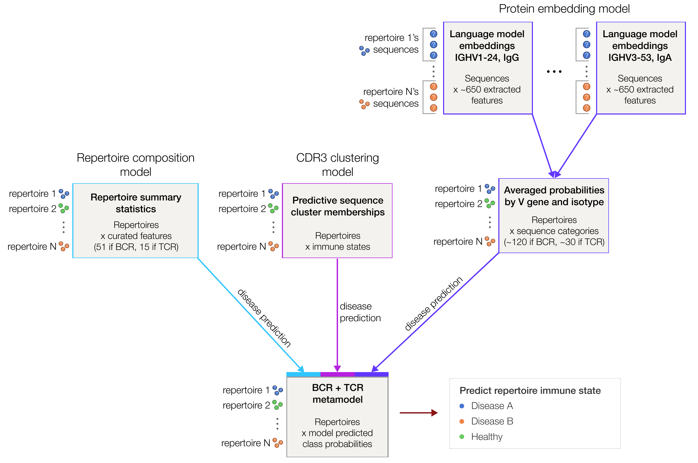

# Mal-ID [](https://codecov.io/gh/maximz/malid)

**Preprint**: [Disease diagnostics using machine learning of immune receptors](https://www.biorxiv.org/content/10.1101/2022.04.26.489314)

Mal-ID uses B cell receptor (BCR) and T cell receptor (TCR) sequencing data to classify disease or immune state. This codebase includes all the code and instructions needed to reproduce the publication and apply Mal-ID to other datasets.

#### Table of Contents

  - [Installation](#installation)
    - [Step 1: Create a conda or pyenv virtual environment](#step-1-create-a-conda-or-pyenv-virtual-environment)
        - [Option A: Create a GPU conda environment](#option-a-create-a-gpu-conda-environment)
        - [Option B: Create a CPU-only conda environment](#option-b-create-a-cpu-only-conda-environment)
        - [Option C: Create a CPU-only virtual environment using `pyenv`](#option-c-create-a-cpu-only-virtual-environment-using-pyenv)
    - [Step 2: Install required packages](#step-2-install-required-packages)
  - [Usage](#usage)
    - [Sequence data](#sequence-data)
    - [Metadata](#metadata)
    - [Cross validation splits](#cross-validation-splits)
  - [Configuration](#configuration)
    - [Adding new datasets](#adding-new-datasets)
  - [Runbook](#runbook)
    - [Load data](#load-data)
    - [Subsample data](#subsample-data)
    - [Generate cross validation folds](#generate-cross-validation-folds)
    - [Prepare for embedding](#prepare-for-embedding)
    - [Fine-tune the language model — but only if the configured embedder requires it](#fine-tune-the-language-model--but-only-if-the-configured-embedder-requires-it)
    - [Run the language model (regardless of whether it's off-the-shelf or fine-tuned)](#run-the-language-model-regardless-of-whether-its-off-the-shelf-or-fine-tuned)
    - [Train and evaluate base models, starting with Model 1](#train-and-evaluate-base-models-starting-with-model-1)
    - [Train and evaluate Model 2](#train-and-evaluate-model-2)
    - [Benchmark against an "exact matches" classifier](#benchmark-against-an-exact-matches-classifier)
    - [Train and analyze Model 3](#train-and-analyze-model-3)
      - [Train sequence-level models split by V gene and isotype](#train-sequence-level-models-split-by-v-gene-and-isotype)
      - [Train aggregation model](#train-aggregation-model)
      - [Analyze the aggregation stage model](#analyze-the-aggregation-stage-model)
    - [Train and analyze ensemble metamodel](#train-and-analyze-ensemble-metamodel)
      - [Metamodel input features are determined by the selected "metamodel flavor" and sequencing loci](#metamodel-input-features-are-determined-by-the-selected-metamodel-flavor-and-sequencing-loci)
      - [Train the metamodel](#train-the-metamodel)
      - [Analyze metamodel performance](#analyze-metamodel-performance)
    - [Analyze known binder sequence databases](#analyze-known-binder-sequence-databases)
      - [SARS-CoV-2 antibodies from CoV-AbDab](#sars-cov-2-antibodies-from-cov-abdab)
      - [SARS-CoV-2 TCRs from MIRA](#sars-cov-2-tcrs-from-mira)
      - [Influenza antibodies](#influenza-antibodies)
      - [Generate language model embeddings for the known binder datasets](#generate-language-model-embeddings-for-the-known-binder-datasets)
      - [Run analysis](#run-analysis)
    - [Confounder checks](#confounder-checks)
    - [Analyze lupus misclassifications](#analyze-lupus-misclassifications)
    - [Validate on external cDNA-derived cohorts](#validate-on-external-cdna-derived-cohorts)
    - [Compare in-house and Adaptive TCR data V gene use](#compare-in-house-and-adaptive-tcr-data-v-gene-use)
    - [Analysis of healthy sample replicates](#analysis-of-healthy-sample-replicates)
  - [Development](#development)
    - [First time setup](#first-time-setup)
    - [Everyday use commands](#everyday-use-commands)
    - [Best practices](#best-practices)
    - [Jupyter Lab extensions](#jupyter-lab-extensions)
    - [Jupytext mirroring](#jupytext-mirroring)
    - [Other tips](#other-tips)

## Installation

Follow the steps below to create a Python environment and install the required dependencies for Mal-ID.

### Step 1: Create a conda or pyenv virtual environment

> [!TIP]
> Here's how to choose which environment to create:
>
> - **Do you have a GPU?** Choose [Option A: create a GPU conda environment](#option-a-create-a-gpu-conda-environment). _This is the preferred setup for using Mal-ID._ GPU access is strongly recommended for generating language model embeddings.
> - **Otherwise, do you use Conda?** Choose [Option B: create a CPU-only conda environment](#option-b-create-a-cpu-only-conda-environment).
> - **If neither of the above apply, we recommend creating a Python virtual environment.** Choose [Option C: create a CPU-only virtual environment using `pyenv`](#option-c-create-a-cpu-only-virtual-environment-using-pyenv). This setup is preferred for local development.

### Option A: Create a GPU conda environment

<details>
  <summary>Expand instructions:</summary>

If you don't have Conda installed yet:

```bash
# install Mambaforge (https://github.com/conda-forge/miniforge#mambaforge)
curl -L -O "https://github.com/conda-forge/miniforge/releases/latest/download/Mambaforge-$(uname)-$(uname -m).sh"
bash "Mambaforge-$(uname)-$(uname -m).sh" -b -p "$HOME/miniconda"

source ~/miniconda/bin/activate
conda init
```

Then log out and log back in.

Otherwise, if you already have Conda installed, just install `mamba`, a faster drop-in replacement for the `conda` command:

```bash
# Install mamba to replace conda
conda install mamba -n base -c conda-forge
```

Now create a conda environment called `cuda-env-py39`:

```bash
# Create env
# Based on https://docs.rapids.ai/install and https://github.com/rapidsai/cuml/blob/branch-23.06/conda/environments/all_cuda-118_arch-x86_64.yaml
mamba create -n cuda-env-py39 -c conda-forge python=3.9 -y;

# Activate env
conda activate cuda-env-py39;

which nvcc # should be blank - confirms that systemwide cuda env isn't visible

# Install environment.
# Somehow, putting this in an `environment.yml` and running `mamba env create -f environment.yml` breaks the solver.
# Based on https://docs.rapids.ai/install and https://github.com/rapidsai/cuml/blob/branch-23.06/conda/environments/all_cuda-118_arch-x86_64.yaml
# Install cudatoolkit along with cuda and cudnn libraries (don't use system ones)
# cudnn: Find cudnn version based on tensorflow GPU compatibility chart https://www.tensorflow.org/install/source#gpu and what's available at conda-forge (https://anaconda.org/conda-forge/cudnn/files). See also these docs: https://docs.nvidia.com/deeplearning/cudnn/support-matrix/index.html
# hdf5: version requirement comes from libgdal
# graphviz, scanpy also installed
mamba install \
    -c rapidsai \
    -c conda-forge \
    -c nvidia \
    cuda=11.8 \
    cuda-nvcc=11.8 \
    cuda-python=11.8 \
    'conda-forge::cupy=12.1*' \
    cuda-version=11.8 \
    'conda-forge::cudnn=8.8*' \
    cudatoolkit=11.8 \
    rapids=23.06 \
    'gcc_linux-64=13.1.0' \
    'librmm==23.6.*' \
    c-compiler \
    cxx-compiler \
    'dask-cuda==23.6.*' \
    'dask-cudf==23.6.*' \
    'conda-forge::h5py=3.7.0' \
    'conda-forge::hdf5=1.12.1' \
    'conda-forge::python-graphviz' 'conda-forge::graphviz' \
    'conda-forge::python-snappy' 'conda-forge::snappy' \
    'bioconda::seqkit' \
    -y;

# We also need a specific Fortran compiler version for glmnet (but looks like we can have libgfortran5 installed simultaneously). Specifically, we need libgfortran.so.4.
# Including this package above breaks the solver, so we have to install separately. This will also downgrade libgfortran-ng to 7.5.0.
# mamba install -c conda-forge 'libgfortran4=7.5.0' -y;
# Update: the above line no longer works on its own either. We have to install directly. URL pulled from https://anaconda.org/conda-forge/libgfortran4/files:
mamba install 'https://anaconda.org/conda-forge/libgfortran4/7.5.0/download/linux-64/libgfortran4-7.5.0-h14aa051_20.tar.bz2';

# Check again
which nvcc # ~/anaconda3/envs/cuda-env-py39/bin/nvcc
nvcc --version # Cuda compilation tools, release 11.8, V11.8.89
```

Add this to `~/.bashrc`:

```bash
# Turn off Jax GPU memory preallocation
# Without this, Jax fills up the GPU completely and isn't cleared. Then any use of non-Jax GPU libraries will fail because GPU memory is full.
# See https://jax.readthedocs.io/en/latest/gpu_memory_allocation.html and https://github.com/google/jax/issues/1222
export XLA_PYTHON_CLIENT_PREALLOCATE=false
export XLA_PYTHON_CLIENT_ALLOCATOR=platform

# Solve Jax CUDA problem:
# external/org_tensorflow/tensorflow/stream_executor/cuda/cuda_asm_compiler.cc:57] cuLinkAddData fails. This is usually caused by stale driver version.
# external/org_tensorflow/tensorflow/compiler/xla/service/gpu/gpu_compiler.cc:1320] The CUDA linking API did not work. Please use XLA_FLAGS=--xla_gpu_force_compilation_parallelism=1 to bypass it, but expect to get longer compilation time due to the lack of multi-threading.
# jaxlib.xla_extension.XlaRuntimeError: UNKNOWN: no kernel image is available for execution on the device
# see https://github.com/google/jax/issues/5723
export XLA_FLAGS="--xla_gpu_force_compilation_parallelism=1"
```

Apply the `~/.bashrc` changes:

```bash
source ~/.bashrc
conda activate cuda-env-py39
```

</details>

### Option B: Create a CPU-only conda environment

<details>
  <summary>Expand instructions:</summary>

If you don't have Conda installed yet:

```bash
# install Mambaforge (https://github.com/conda-forge/miniforge#mambaforge)
curl -L -O "https://github.com/conda-forge/miniforge/releases/latest/download/Mambaforge-$(uname)-$(uname -m).sh"
bash "Mambaforge-$(uname)-$(uname -m).sh" -b -p "$HOME/miniconda"

source ~/miniconda/bin/activate
conda init
```

Then log out and log back in.

Otherwise, if you already have Conda installed, just install `mamba`, a faster drop-in replacement for the `conda` command:

```bash
# Install mamba to replace conda
conda install mamba -n base -c conda-forge
```

Now create a conda environment called `cuda-env-py39`:

```bash
mamba create -n cuda-env-py39 -c conda-forge python=3.9 gcc gxx gfortran -y;

conda activate cuda-env-py39;

# We also need a specific Fortran compiler version for glmnet (but looks like we can have libgfortran5 installed simultaneously). Specifically, we need libgfortran.so.4.
# Including this package above breaks the solver, so we have to install separately. This will also downgrade libgfortran-ng to 7.5.0.
# mamba install -c conda-forge 'libgfortran4=7.5.0' -y;
# Update: the above line no longer works on its own either. We have to install directly. URL pulled from https://anaconda.org/conda-forge/libgfortran4/files:
mamba install 'https://anaconda.org/conda-forge/libgfortran4/7.5.0/download/linux-64/libgfortran4-7.5.0-h14aa051_20.tar.bz2';
```

</details>

### Option C: Create a CPU-only virtual environment using `pyenv`

<details>
  <summary>Expand instructions:</summary>

Install `pyenv`:

```bash
brew update && brew install pyenv; # on Mac

pyenv install 3.9
pyenv global 3.9
git clone https://github.com/pyenv/pyenv-virtualenv.git $(pyenv root)/plugins/pyenv-virtualenv

echo 'eval "$(pyenv init -)"' >> ~/.zshrc
# eval "$(pyenv virtualenv-init -)"
# the above makes every shell command very slow
# instead, try this (https://github.com/pyenv/pyenv-virtualenv/issues/259#issuecomment-1007432346):
echo 'eval "$(pyenv virtualenv-init - | sed s/precmd/chpwd/g)"' >> ~/.zshrc
exec "$SHELL" # restart shell
```

Create a `pyenv` virtual environment called `malid-3.9`:

```bash
pyenv virtualenv 3.9 malid-3.9
echo 'malid-3.9' > .python-version
pyenv version # malid-3.9
```

</details>

### Step 2: Install required packages

> [!IMPORTANT]
> Run these steps regardless of whether you selected Option A, Option B, or Option C above.
>
> **If you're using Option B or Option C: comment out the `requirements_gpu.txt` line, and uncomment the `requirements_cpu.txt` line**, because these are CPU-only environments.

First, activate your newly created environment: `conda activate cuda-env-py39`.

Then install packages with `pip`:

```bash
which pip # make sure this points where you expect it: either your conda or pyenv environment
pip install --upgrade pip wheel

# General requirements (clone github repos into a sibling directory):
rm -r ../cuda-env-py39-pkgs
mkdir -p ../cuda-env-py39-pkgs
pip install -r requirements.txt --src ../cuda-env-py39-pkgs


## MAKE EDITS HERE DEPENDING ON OPTION A, B, OR C ABOVE:
# Option A: GPU specific requirements
pip install -r requirements_gpu.txt --src ../cuda-env-py39-pkgs

# Option B or Option C: CPU specific requirements
# pip install -r requirements_cpu.txt --src ../cuda-env-py39-pkgs


# Further general requirements that rely on the CPU/GPU-specific requirements being installed:
pip install -r requirements_extra.txt --src ../cuda-env-py39-pkgs

# Some pip errors are expected, such as:
pip check
# cudf 23.6.1 requires cupy-cuda11x>=12.0.0, which is not installed.
# cugraph 23.6.2 requires cupy-cuda11x>=12.0.0, which is not installed.
# cuml 23.6.0 requires cupy-cuda11x>=12.0.0, which is not installed.
# dask-cudf 23.6.1 requires cupy-cuda11x>=12.0.0, which is not installed.
# referencing 0.30.0 requires attrs>=22.2.0, but you have attrs 21.4.0 which is incompatible.
# Don't worry about these. For example, cupy 12.0 is already installed via conda, but pip just isn't aware.

# Add kernel to system-wide jupyter notebook
ipython kernel install --name py39-cuda-env --user
# Installed kernelspec py39-cuda-env in ~/.local/share/jupyter/kernels/py39-cuda-env

# Install the Mal-ID package itself
pip install -e .

# Install IgBlast v1.3.0:
cd igblast
wget https://ftp.ncbi.nih.gov/blast/executables/igblast/release/1.3.0/ncbi-igblast-1.3.0-x64-linux.tar.gz
tar -zxvf ncbi-igblast-1.3.0-x64-linux.tar.gz
mv ncbi-igblast-1.3.0/bin/* .
rm -r ncbi-igblast-1.3.0/

# Download PyIR reference data
# This download can time out and may need to be rerun.
# (See also "Optional: Cache PyIR reference data for faster setup in future" below)
pyir setup
```

Set up the `data/` directory with `mkdir -p data`. (Or symlink `data` to a network-mounted data directory; for example, we run `ln -s /mnt/lab_data/kundaje/projects/malid data`.)

Finally, validate your installation:

```bash
# Run all tests
pytest tests/test_dependencies.py # confirm core dependencies properly installed
pytest
pytest --gpu # Skip if using Option B or Option C (CPU only)
```

<details>
  <summary>Optional: Install fonts</summary>

We use Helvetica in our matplotlib plots. Here's how to install TTF font files from `data/fonts/`:

```bash
echo "$(python -c 'import matplotlib; print(matplotlib.get_data_path())')/fonts/ttf"
cp data/fonts/*.ttf "$(python -c 'import matplotlib; print(matplotlib.get_data_path())')/fonts/ttf"
python -c 'import matplotlib.font_manager; matplotlib.font_manager._load_fontmanager(try_read_cache=False)'
```

</details>

<details>
  <summary>Optional: Cache PyIR reference data for faster setup in future</summary>

Running `pyir setup` triggers a slow IMGT data download which often times out.

After a successful download, you can cache the PyIR reference data to make future setup fast and reliable:

```bash
# First time
pyir setup
rm -r data/pyir_cache
mkdir -p data/pyir_cache/germlines
cp -r "$(python -c 'import site; print(site.getsitepackages()[0])')/crowelab_pyir/data" data/pyir_cache
```

In the future, instead of running `pyir setup`, install the saved version of the PyIR reference data:

```bash
echo "$(python -c 'import crowelab_pyir; from pathlib import Path; print(Path(crowelab_pyir.__file__).parent / "data")')"
cp -r data/pyir_cache/germlines "$(python -c 'import crowelab_pyir; from pathlib import Path; print(Path(crowelab_pyir.__file__).parent / "data")')"
```

</details>

## Usage

> [!TIP]
> **[Start with the tutorial.](https://nbviewer.org/github/maximz/malid/blob/master/notebooks/tutorial.ipynb)**

### Sequence data

Mal-ID accepts BCR and TCR data in:

- [AIRR format](https://docs.airr-community.org/en/stable/)
- [Adaptive ImmuneAccess format](https://clients.adaptivebiotech.com/immuneaccess/browse)
- Mal-ID internal "participant table" format — called "part tables" for short. (Part tables can be converted to AIRR rearrangement format with `python scripts/convert_part_table_to_airr_format.py input_part_table.bz2 airr_output.tsv`.)

The data goes through several transformations before being used in models. _See the full runbook below for instructions on how to run these transformations._

First, the data is converted to structured Parquet format using `notebooks/etl.ipynb` and saved to disk at the file path stored as `malid.config.paths.sequences`. The Parquet data is partitioned on disk by `participant_label` and `specimen_label`, referring to the patient ID and sample ID, respectively. Other fields include:

- `v_gene`: IGHV or TRBV gene segment name
- `j_gene`: IGHJ or TRBJ gene segment name
- `cdr3_seq_aa_q_trim`: CDR3 amino acid sequence
- `v_mut`: Somatic hypermutation rate, specifically the fraction of V region nucleotides that are mutated (BCR only)
- `isotype_supergroup`: either `IGHG`, `IGHA`, `IGHD-M` (combining IgD and IgM), or `TCRB`. The name "supergroup" refers to the fact that we are overloading the definition of isotypes by combining IgD and IgM, and by labeling all TCR data as `isotype_supergroup="TCRB"` for convenience so the two types of sequences can be stored in the same Parquet data, even though TCRs don't have isotypes by definition. (Note that IgE is filtered out in the subsampling step, as are unmutated IgD and IgM sequences which represent naive B cells.)
- _See the `malid.etl.dtypes_expected_after_preprocessing` object for the full schema._

Next, the data is subsampled to one sequence per isotype from each clone for each sample or replicate. This happens in `notebooks/sample_sequences.ipynb`, and the logic is implemented in `malid/sample_sequences.py`. At this point, we also remove samples with low clone counts and filter out IgE, unmutated IgM, and unmutated IgD data.

Finally, the data is split into cross-validation folds and the sequences are transformed into language model embeddings. The data can now be loaded using the `malid.io.load_fold_embeddings` function, which returns AnnData objects. Assuming the AnnData object is named `adata`, a matrix of embedding vectors is accessible via `adata.X`, and the metadata and raw sequences are stored as a Pandas DataFrame under `adata.obs`. _See the [tutorial](https://nbviewer.org/github/maximz/malid/blob/master/notebooks/tutorial.ipynb) for a demo._

Raw BCR and TCR sequences are stored together in Parquet, but their embeddings are stored in separate AnnData objects. We train all the models using the AnnData objects divided into cross validation folds, even though some models only use the `.obs` data and ignore the `.X` embeddings, to ensure that all models use exactly the same sets of sequences.

### Metadata

The metadata includes the `disease`, `disease_subtype`, `study_name`, `age`, `sex`, and `ethnicity_condensed` (ancestry) that correspond to a particular sample, as available.

In addition to being found in `adata.obs`, the metadata can also be loaded directly through `malid.helpers.get_all_specimen_info`. Each sample is identified by a `specimen_label` and has a boolean column named `in_training_set`, indicating whether a sample met the QC requirements and had any sequences remaining after subsampling, and whether a sample met the requirements for inclusion in the cross validation folds. (These two properties are declared in the boolean columns `survived_filters` and `is_selected_for_cv_strategy`, respectively; both must be `True` for `in_training_set` to be `True`).

### Cross validation splits

The inclusion criteria for the cross validation divisions are defined as a `CrossValidationSplitStrategy` object in `malid/datamodels.py`. The default strategy is `CrossValidationSplitStrategy.in_house_peak_disease_timepoints`, which includes peak disease timepoints from our primary in-house dataset. Another strategy is `CrossValidationSplitStrategy.adaptive_peak_disease_timepoints`, which is the same idea but for Adaptive ImmuneAccess data.

If a sample matches the activated cross validation split strategy configured in `malid/config.py`, then the metadata column `is_selected_for_cv_strategy` will be marked `True`. The sample will be included in the cross validation folds as long as it also has `survived_filters` set to `True` (i.e. it has passed QC filters).

The data is divided into three folds: `fold_id` can be 0, 1, or 2. Each fold has a `train_smaller`, `validation`, and `test` set, referred to as a `fold_label`. The `train_smaller` set is further subdivided into `train_smaller1` and `train_smaller2`.

Each sample will be in one test set. We also make sure that all samples from the same person have the same `fold_label`.

Finally, we define a special `fold_id=-1` "global" fold that does not have a `test` set. All the data is instead used in the `train_smaller` and `validation` fold labels. (The `train_smaller` to `validation` proportion is the same as for other fold IDs, but both sets are larger than usual.)

Some cross validation split strategies, like `CrossValidationSplitStrategy.in_house_peak_disease_leave_one_cohort_out` and `CrossValidationSplitStrategy.adaptive_peak_disease_timepoints_leave_some_cohorts_out`, only create a single fold, with `fold_id = 0`. Here, the cross validation design forces specific cohorts to be held out from the training set.

## Configuration

You can control most settings in `malid/config.py`:

- **Dataset version**: set in `config._default_dataset_version`. We usually use a date like 20231027, and update it when we make changes to the dataset. Can be overriden with the `MALID_DATASET_VERSION` environment variable.

- **Which language model is used and which sequence regions are embedded**: set in `config._default_embedder`, or overriden with `EMBEDDER_TYPE` environment variable, which accepts `name` property values from any embedder (e.g. `EMBEDDER_TYPE='esm2_cdr3'`). See `malid/embedders/__init__.py` for a list of embedders, which include a choice of the base language model and a choice of the sequence regions to be embedded (e.g. CDR3 only, or the concatenation of CDR1, CDR2, and CDR3).

- **Which data is incorporated into the cross validation divisions**: determined by `config._default_cross_validation_split_strategy`, which defaults to `CrossValidationSplitStrategy.in_house_peak_disease_timepoints`. Can be overriden with the `MALID_CV_SPLIT` environment variable, which accepts the name of any CrossValidationSplitStrategy enumeration value (e.g. `MALID_CV_SPLIT='in_house_peak_disease_timepoints'`).

- **Which classification targets to train models for**: controlled by `config._default_classification_targets`, which defaults to a list of all possible classification targets defined under `TargetObsColumnEnum` in `malid/datamodels.py`.

- **File paths**: set in `config.paths`, then created with `python scripts/make_dirs.py`. Many of the paths are generated based on the dataset version, the cross validation split strategy, the language model embedder used, and so on.

- **Which versions of Models 1, 2, and 3 are used in the ensemble metamodel**: controlled by `config.metamodel_base_model_names`. For example, this is where we indicate that the ensemble metamodel should incorporate the ridge logistic regression (`ridge_cv`) version of Model 2 for BCR data. These are set by hand according to validation set performance scores of Models 1, 2, and 3, before the ensemble metamodel is fitted on the validation set.

> [!IMPORTANT]
> When overriding a setting with an environment variable, the environment variable will be used if it is set, otherwise the default value in `config.py` will be used.
>
> Make sure to set the environment variable _before_ importing any code from the `malid` namespace. Either preface your command with the environment variable assignment (`ENVVAR='value' python scripts/...` or `ENVVAR='value' ./run_notebooks.sh notebooks/...`), or run set the environment variable at the very beginning of your Python session (`import os; os.environ['ENVVAR'] = 'value'`).

### Adding new datasets

Follow these steps to add new datasets:

1. Look up the `CrossValidationSplitStrategy` definition corresponding to your data format in this table:

    | Data format | `CrossValidationSplitStrategy` name |
    | --- | --- |
    | AIRR | `CrossValidationSplitStrategy.external_data` |
    | Adaptive ImmuneAccess | `CrossValidationSplitStrategy.adaptive_peak_disease_timepoints` |
    | In-house | `CrossValidationSplitStrategy.in_house_peak_disease_timepoints` |

    The following instructions will refer to the name of the `CrossValidationSplitStrategy` enumeration value as `$SPLIT_STRATEGY` (e.g. `in_house_peak_disease_timepoints`).

2. Update `diseases = [...]` in `malid/datamodels.py` to include any new diseases.

3. Update the `$SPLIT_STRATEGY = CrossValidationSplitStrategyValue(...)` definition in `malid/datamodels.py`. List any new diseases added in the `diseases_to_keep_all_subtypes` field.

    Alternatively, adjust the `subtypes_keep` field if you'd like to include only samples with certain `disease_subtype` values. (For example, if you have peak and off-peak samples of a disease called "Disease A", you could add `subtypes_keep = ['Disease A - peak']`.)

4. Set `_default_cross_validation_split_strategy = CrossValidationSplitStrategy.$SPLIT_STRATEGY` in `malid/config.py`.

5. Increment the `dataset_version` in `malid/config.py`.

6. Reset the output directory: `rm -r out && mkdir -p out`.

7. Import the sequencing data and metadata. Instructions depend on the data format:

    - <details>
        <summary><b>AIRR format:</b></summary>

        1. Place raw data files in `data/external_cohorts/raw_data`, in a subfolder named the same as the study name used in the metadata.

        2. Run the raw sequences through our pinned version of IgBlast, for consistency with the other datasets in this project. To do so, run the following commands, which export sequences from each sample to fasta files, run IgBlast, and then parse the IgBlast outputs into `*.parsed.IgH.tsv` and `*.parsed.TCRB.tsv` files:

            ```bash
            # Replace "study_name" in the below commands with your actual study name.
            # Manually create a file with all specimen labels: data/external_cohorts/raw_data/study_name/all_specimen_labels.txt

            ## Step 1: Loop over specimens and create fasta files, which will be inputs to IgBlast:
            for specimen_label in $(cat data/external_cohorts/raw_data/study_name/all_specimen_labels.txt)
            do
                # Export the sequences to fasta.
                # Set --column to the column name in the TSV file that contains the raw nucleotide sequences.
                # (Note the special escape for tab delimter character -- used because the input is a tsv file.)
                python scripts/export_sequences_to_fasta.py \
                    --input "data/external_cohorts/raw_data/study_name/$specimen_label.tsv" \
                    --output "data/external_cohorts/raw_data/study_name/$specimen_label.fasta" \
                    --name "$specimen_label" \
                    --separator $'\t' \
                    --column "sequence";

                # Chunk the fasta file, converting sample_name.fasta into sample_name.fasta.part_001.fasta, etc.
                seqkit split2 "data/external_cohorts/raw_data/study_name/$specimen_label.fasta" -O "data/external_cohorts/raw_data/study_name" --by-size 10000 --by-size-prefix "$specimen_label.fasta.part_"

                echo "$specimen_label.tsv" "$specimen_label.fasta"
            done

            ##########

            ## Step 2: Run IgBlast:
            # Input: data/external_cohorts/raw_data/study_name/sample_name.fasta.part_001.fasta
            # Output: data/external_cohorts/raw_data/study_name/sample_name.fasta.part_001.fasta.parse.txt

            # Create temporary directory for IgBlast
            tmpdir_igblast=$(mktemp -d)
            echo "$tmpdir_igblast"
            cp scripts/run_igblast_command.sh "$tmpdir_igblast";
            cp scripts/run_igblast_command_tcr.sh "$tmpdir_igblast";
            cp igblast/igblastn "$tmpdir_igblast";
            cp igblast/human_gl* "$tmpdir_igblast";
            cp -r igblast/internal_data/ "$tmpdir_igblast";
            workdir=$(pwd) # mark current directory
            pushd "$tmpdir_igblast" # switch to new directory
            num_processors=50 # set parallelization level

            # (Explanation of arguments:
            # use -print0 and -0 to handle spaces in filenames
            # _ is a dummy value for $0, the script name
            # $1 in the sh -c command will be the filename)
            # COMMAND FOR BCR:
            find $workdir/data/external_cohorts/raw_data/study_name/ -name "*.part_*.fasta" -print0 | xargs -0 -I {} -n 1 -P "$num_processors" sh -c './run_igblast_command.sh "$1"' _ {}
            echo $? # Check exit code

            # COMMAND FOR TCR:
            find $workdir/data/external_cohorts/raw_data/study_name/ -name "*.part_*.fasta" -print0 | xargs -0 -I {} -n 1 -P "$num_processors" sh -c './run_igblast_command_tcr.sh "$1"' _ {}
            echo $? # Check exit code

            popd
            echo "$tmpdir_igblast"
            rm -r "$tmpdir_igblast"

            # Monitor: these numbers must match
            find data/external_cohorts/raw_data/study_name/ -name "*.part_*.fasta" | wc -l
            find data/external_cohorts/raw_data/study_name/ -name "*.part_*.fasta.parse.txt" | wc -l

            ##########

            ## Step 3: Parse IgBlast outputs:

            # The command is:
            # For BCR: scripts/parse_igblastn.py --locus IgH *.parse.txt
            # For TCR: scripts/parse_igblastn.py --locus TCRB *.parse.txt
            # But we will parallelize in chunk size of 50 parses x 40 processes:
            num_processors=40
            # (Argument explanation: use -print0 and -0 to handle spaces in filenames)
            # COMMAND FOR BCR:
            find data/external_cohorts/raw_data/study_name/ -name "*.part_*.fasta.parse.txt" -print0 | xargs -0 -x -n 50 -P "$num_processors" scripts/parse_igblastn.py --locus "IgH"
            echo $? # Check exit code

            # COMMAND FOR TCR:
            find data/external_cohorts/raw_data/study_name/ -name "*.part_*.fasta.parse.txt" -print0 | xargs -0 -x -n 50 -P "$num_processors" scripts/parse_igblastn.py --locus "TCRB"
            echo $? # Check exit code

            # Monitor: these numbers must match
            find data/external_cohorts/raw_data/study_name/ -name "*.part_*.fasta.parse.txt" | wc -l
            # If BCR:
            find data/external_cohorts/raw_data/study_name/ -name "*.part_*.fasta.parse.txt.parsed.IgH.tsv" | wc -l
            # If TCR:
            find data/external_cohorts/raw_data/study_name/ -name "*.part_*.fasta.parse.txt.parsed.TCRB.tsv" | wc -l
            ```

            (See `notebooks/airr_external_data/readme.md` for examples of how these commands were run for other AIRR format datasets.)

        3. Add metadata in `notebooks/airr_external_data/combine_external_cohort_metadata.ipynb` under "Add new studies here". This notebook loads and combines the metadata files for all studies, producing a table named `metadata/generated.external_cohorts.tsv`.

            Here is starter code you can add at the "Add new studies here" line of the notebook:

            ```python
            df = pd.DataFrame(
                {
                    # Study name: Must match the folder name in data/external_cohorts/raw_data
                    "study_name": "newstudy",
                    #
                    # Patient ID:
                    "participant_label": ["patient1", "patient2", "patient3"],
                    #
                    # Sample ID:
                    # Data will be loaded from data/external_cohorts/raw_data/newstudy/sample1.tsv, data/external_cohorts/raw_data/newstudy/sample2.tsv, and so on.
                    "specimen_label": ["sample1", "sample2", "sample3"],
                    #
                    "gene_locus": "BCR", # or "TCR"
                    #
                    "disease": ["Covid19", "Covid19", healthy_label],
                }
            )
            all_studies.append(df)
            ```

            These metadata columns must be set:

            - `study_name`: The name of the study, which should match the folder name in `data/external_cohorts/raw_data`.
            - `participant_label`: The patient ID. (In the final metadata, this will be automatically prefixed with the study name to make it globally unique.)
            - `specimen_label`: The sample ID. (In the final metadata, this will be automatically prefixed with the study name to make it globally unique.)
            - `gene_locus`: "BCR" or "TCR".
            - `disease`: The diagnosis for this patient.

            Optional metadata columns include:

            - `disease_subtype`: The subtype of the disease, if applicable.
            - `file_extension`: The file extension of the raw data files. This will be set to "tsv" by default, but can be changed to "csv", "tsv.gz", or other values as appropriate.
            - `sample_name`: The name of the sample. This will be set to the specimen_label value by default. Override if the file name for the sequencing data is different from the specimen label. The data will be loaded from `data/external_cohorts/raw_data/{study_name}/{sample_name}.{file_extension}`.
            - `expect_a_read_count_column`: Set to False if there is no read count column named "num_reads", "reads", "templates", "seq_reads", or "count (templates/reads)". Will be set to True by default.

    </details>

    - <details>
        <summary><b>Adaptive ImmuneAccess TCR format:</b></summary>

        1. Place raw data files in `data/external_cohorts/raw_data/adaptive_immuneaccess`, in a subfolder named the same as the study name used in the metadata.

        2. Then place the ImmuneAccess metadata file in `metadata/adaptive/study_name.tsv` (replacing `study_name` with the study name).

        3. Register the study in the `notebooks/airr_external_data/adaptive_cohorts.metadata.ipynb` notebook, which loads and combines the metadata files for all studies, producing a table named `metadata/adaptive/generated.adaptive_external_cohorts.tsv`. Here is starter code you can add at the "Add additional studies here" line of the notebook:

            ```python
            # Load the metadata file stored at metadata/adaptive/study_name.tsv:
            df = _load_metadata_df("study_name")  # Replace study_name with the real study name

            # Set sequencing type — usually genomic DNA for Adaptive data:
            df["sequencing_type"] = "gDNA"

            # Set participant_label (patient ID) and specimen_label (sample ID):
            df["specimen_label"] = df["sample_name"]
            df["participant_label"] = df["sample_name"]

            # Set disease. This example assumes sample_name has "Pos" for Covid-19 samples and "Neg" for healthy samples:
            df["disease"] = (
                df["sample_name"].str.contains("Pos").map({True: "Covid-19", False: healthy_label})
            )

            # Set disease_subtype.
            # If there is no relevant metadata for this, we can just set it to the disease name:
            df["disease_subtype"] = df["disease"].copy()

            # Add this study to the collection of metadata dataframes:
            dfs_adaptive_manual.append(df)
            ```

        4. Follow the commands in `adaptive_runbook.md` to run the raw sequences through our pinned version of IgBlast, for consistency with the other datasets in this project. The commands in that file will process the new samples you've added to the metadata collection of all Adaptive datasets in this project. They'll export sequences from each sample to fasta files, run IgBlast, and then parse the IgBlast outputs into `*.parsed.TCRB.tsv` files — which will be loaded into the Mal-ID project when you run `notebooks/etl.ipynb` in the runbook instructions below.

    </details>

    - <details>
        <summary><b>In-house format:</b></summary>

        1. Follow the preprocessing steps outlined in `preprocessing/`.

        2. Register the new data file paths in `notebooks/etl.ipynb`.

        3. Add sample metadata to `notebooks/assemble_etl_metadata.ipynb`.

    </details>

8. Run the runbook commands below. Make sure that `notebooks/etl.ipynb` succeeds in loading the new data, `notebooks/sample_sequences.ipynb` succeeds in subsampling the data, and `notebooks/make_cv_folds.ipynb` succeeds in creating the cross validation folds which include the data.

## Runbook

This is the entire set of commands to load data, train the models, and evaluate the results.

> [!TIP]
> Jupyter notebooks can be run interactively, or they can be run from the command line with `./run_notebooks.sh notebooks/notebook_name.ipynb`.

### Load data

Register raw data file paths for our in-house data in `notebooks/etl.ipynb`.

For AIRR and Adaptive data formats: Run the instructions in `notebooks/airr_external_data/readme.md` to process AIRR format data, and `adaptive_runbook.md` for Adaptive format data, respectively. These instructions will guide you to place raw data files in `data/external_cohorts/raw_data` indexed by the study names used in the metadata. (See [Adding new data](#adding-new-data) above for more details on how to add additional samples.)

Then run:

```bash
# Activate the conda environment
conda activate cuda-env-py39;

# Create directories for the dataset
python scripts/make_dirs.py

# Prepare TCRB reference annotations, so that we can fill in framework and CDR regions that are derived from the germline V gene without somatic hypermutation.
python scripts/get_tcr_v_gene_annotations.py;

# Collect metadata
./run_notebooks.sh \
    notebooks/assemble_etl_metadata.ipynb \
    notebooks/airr_external_data/covid_tcr_immunecode_metadata.ipynb \
    notebooks/airr_external_data/adaptive_cohorts.metadata.ipynb \
    notebooks/airr_external_data/metadata_per_patient.ipynb \
    notebooks/airr_external_data/metadata_shomuradova.ipynb \
    notebooks/airr_external_data/metadata_britanova.ipynb \
    notebooks/airr_external_data/combine_external_cohort_metadata.ipynb;

# Run the data loading ETL steps
./run_notebooks.sh notebooks/etl.ipynb;

# Examine the data that was loaded.
./run_notebooks.sh \
    notebooks/participant_specimen_disease_map.ipynb \
    notebooks/read_counts_per_specimen.ipynb \
    notebooks/get_all_v_genes.ipynb; # The final notebook generates a list of all observed V genes in our dataset so we can add V gene dummy variables to our models
```

Review `out/reads_per_specimen_and_isotype.tsv` to make sure the right amount of data was loaded.

### Subsample data

Now, we narrow down from "all data" to "data that has survived quality filters and has been subsampled".

```bash
# Apply QC filters and downsample to one sequence per clone, per isotype, per replicate of specimen.
# (See malid/sample_sequences.py for the exact details of the filtering and sampling steps.)
./run_notebooks.sh \
    notebooks/sample_sequences.ipynb \
    notebooks/record_which_specimens_remain_after_qc_filtering.ipynb;
```

Review log messages carefully to see which specimens don't pass QC filtering: `grep 'malid.sample_sequences' notebooks/sample_sequences.ipynb`.

### Generate cross validation folds

> [!NOTE]
> The runbook steps from here onwards are specific to the currently active cross validation split strategy, which is configured in `malid/config.py` through the `_default_cross_validation_split_strategy` attribute (or overriden with the `MALID_CV_SPLIT` environment variable). This setting determines which samples are included in the cross-validation training and testing sets.

Now, we will narrow down from "data that has survived quality filters and has been subsampled", to "data that has been further selected for the currently selected cross validation split strategy", which is defined in `malid/config.py`.

Cross validation split strategies include:

- `CrossValidationSplitStrategy.in_house_peak_disease_timepoints`: default, 3 folds, with each specimen being part of one test set.
- `CrossValidationSplitStrategy.in_house_peak_disease_leave_one_cohort_out`: one single fold with specific study names in the hold-out test set
- `CrossValidationSplitStrategy.in_house_peak_disease_leave_one_lupus_cohort_out`: one single fold with a specific lupus study name in the hold-out test set
- `CrossValidationSplitStrategy.adaptive_peak_disease_timepoints`: 3 folds, like the default but for Adaptive cohorts (TCR only)
- `CrossValidationSplitStrategy.adaptive_peak_disease_timepoints_leave_some_cohorts_out`: one single fold with specific study names in the training set and the hold-out test set

Run this notebook to choose fold assignments for each specimen:

```bash
# Make cross validation (CV) splits, subsetting to specimens for the currently selected cross validation split strategy, such as "in-house samples at peak disease timepoints only".
# This will create train/validation/test splits, along with a global fold that does not have a test set.
# See the notebook for granular details on how the cross validation splits are created.
./run_notebooks.sh notebooks/make_cv_folds.ipynb;
```

To make sure the right data was selected to be distributed among cross validation folds, review the notebook and `out/$CROSS_VALIDATION_SPLIT_STRATEGY_NAME/all_data_combined.participants_by_disease_subtype.tsv` — substituting the cross validation split strategy name (e.g. `in_house_peak_disease_timepoints`) into the file path.

> [!TIP]
> For convenience, the active cross validation split strategy can be overriden temporarily by setting the `MALID_CV_SPLIT` environment variable. For example:
> ```bash
> MALID_CV_SPLIT="adaptive_peak_disease_timepoints" ./run_notebook_to_new_file.sh \
>    notebooks/make_cv_folds.ipynb \
>    notebooks/make_cv_folds.generated.adaptive_peak_disease_timepoints.ipynb;
> ```
>
> This command will run the notebook `make_cv_folds.ipynb` with the `adaptive_peak_disease_timepoints` split strategy, and save the output to a new notebook file `make_cv_folds.generated.adaptive_peak_disease_timepoints.ipynb`.


### Prepare for embedding

Review embedder selection in malid/config.py. It determines the base model and the sequence regions to be embedded (e.g. CDR1+2+3).

Then make the directories: `python scripts/make_dirs.py`.

(Again, this step and all following steps are specific to a particular cross validation split strategy defined in `malid/config.py` or temporarily overriden with the `MALID_CV_SPLIT` environment variable.)

### Fine-tune the language model — but only if the configured embedder requires it

> [!IMPORTANT]
> Skip this section for the default language model embedder used by Mal-ID, which uses ESM-2 off the shelf without fine-tuning.

This step will use the default embedder configured in `malid/config.py`. If the selected embedder has fine-tuning enabled, the fine-tuning process will be run for each training fold and sequencing locus to customize the language model to immunology data.

By fine-tuning, we mean continuing the semi-supervised masked language model training process. The language model is fine-tuned separately for each fold using a subset of the `train_smaller` set, choosing the training epoch with best performance against a subset of the `validation` set. Run fine-tuning on all folds and sequencing loci with this command: `python scripts/fine_tune_language_model.py`.

In practice, we usually split the fine-tuning process across machines by running the fine-tuning script with different `--locus` and `--fold_id` arguments. For example:

```bash
python scripts/fine_tune_language_model.py --locus BCR --fold_id 0 2>&1 | tee "data/logs/fine_tune_language_model.fold0.bcr.log"
python scripts/fine_tune_language_model.py --locus TCR --fold_id 0 2>&1 | tee "data/logs/fine_tune_language_model.fold0.tcr.log"
#
python scripts/fine_tune_language_model.py --locus BCR --fold_id 1 2>&1 | tee "data/logs/fine_tune_language_model.fold1.bcr.log"
python scripts/fine_tune_language_model.py --locus TCR --fold_id 1 2>&1 | tee "data/logs/fine_tune_language_model.fold1.tcr.log"
#
python scripts/fine_tune_language_model.py --locus BCR --fold_id 2 2>&1 | tee "data/logs/fine_tune_language_model.fold2.bcr.log"
python scripts/fine_tune_language_model.py --locus TCR --fold_id 2 2>&1 | tee "data/logs/fine_tune_language_model.fold2.tcr.log"

python scripts/fine_tune_language_model.py --locus BCR --fold_id -1 2>&1 | tee "data/logs/fine_tune_language_model.globalfold.bcr.log"
python scripts/fine_tune_language_model.py --locus TCR --fold_id -1 2>&1 | tee "data/logs/fine_tune_language_model.globalfold.tcr.log"
```

Some embedders can be monitored with Tensorboard (substitute a port number for `$PORT`):

```bash
tensorboard --logdir="$(python -c 'import malid.config; print(malid.config.paths.fine_tuned_embedding_dir)')" --port=$PORT;
```

Then extract language model weights at the epoch with the best validation loss:

```bash
./run_notebooks.sh notebooks/fine_tune.analyze_over_epochs.ipynb;
```

Perform a catastrophic forgetting analysis to ensure that the fine-tuned language model has not forgotten the original pretraining data used to produce the off-the-shelf version:

```bash
# Fetch Uniref50 raw data
wget -O - https://ftp.uniprot.org/pub/databases/uniprot/uniref/uniref50/README # print readme to describe uniref data
wget -O ./data/uniref50.fasta.gz  https://ftp.uniprot.org/pub/databases/uniprot/uniref/uniref50/uniref50.fasta.gz # download ref data
! zcat ./data/uniref50.fasta.gz | echo $((`wc -l`/4)) # 83360861 total sequences

# Assess perplexity/cross validation loss on uniref50 + TCR/BCR sequences
./run_notebooks.sh notebooks/catastrophic_forgetting.ipynb;
```

### Run the language model (regardless of whether it's off-the-shelf or fine-tuned)

Next, we generate sequence embeddings with the configured language model, scale them, and write them to disk in AnnData format. To run this for all folds and sequencing loci:

```bash
python scripts/run_embedding.py
python scripts/scale_embedding_anndatas.py
```

In practice, we usually split this up between machines by running the embedding script with different `--locus` and `--fold_id` arguments:

```bash
python scripts/run_embedding.py --locus BCR --fold_id 0 2>&1 | tee "data/logs/run_embedding.fine_tuned.fold0.bcr.log"
python scripts/scale_embedding_anndatas.py --locus BCR --fold_id 0 2>&1 | tee "data/logs/scale_anndatas_created_with_finetuned_embedding.fold0.bcr.log"

python scripts/run_embedding.py --locus TCR --fold_id 0 2>&1 | tee "data/logs/run_embedding.fine_tuned.fold0.tcr.log"
python scripts/scale_embedding_anndatas.py --locus TCR --fold_id 0 2>&1 | tee "data/logs/scale_anndatas_created_with_finetuned_embedding.fold0.tcr.log"

#

python scripts/run_embedding.py --locus BCR --fold_id 1 2>&1 | tee "data/logs/run_embedding.fine_tuned.fold1.bcr.log"
python scripts/scale_embedding_anndatas.py --locus BCR --fold_id 1 2>&1 | tee "data/logs/scale_anndatas_created_with_finetuned_embedding.fold1.bcr.log"

python scripts/run_embedding.py --locus TCR --fold_id 1 2>&1 | tee "data/logs/run_embedding.fine_tuned.fold1.tcr.log"
python scripts/scale_embedding_anndatas.py --locus TCR --fold_id 1 2>&1 | tee "data/logs/scale_anndatas_created_with_finetuned_embedding.fold1.tcr.log"

#

python scripts/run_embedding.py --locus BCR --fold_id 2 2>&1 | tee "data/logs/run_embedding.fine_tuned.fold2.bcr.log"
python scripts/scale_embedding_anndatas.py --locus BCR --fold_id 2 2>&1 | tee "data/logs/scale_anndatas_created_with_finetuned_embedding.fold2.bcr.log"

python scripts/run_embedding.py --locus TCR --fold_id 2 2>&1 | tee "data/logs/run_embedding.fine_tuned.fold2.tcr.log"
python scripts/scale_embedding_anndatas.py --locus TCR --fold_id 2 2>&1 | tee "data/logs/scale_anndatas_created_with_finetuned_embedding.fold2.tcr.log"

#

python scripts/run_embedding.py --locus BCR --fold_id -1 2>&1 | tee "data/logs/run_embedding.fine_tuned.globalfold.bcr.log"
python scripts/scale_embedding_anndatas.py --locus BCR --fold_id -1 2>&1 | tee "data/logs/scale_anndatas_created_with_finetuned_embedding.globalfold.bcr.log"

python scripts/run_embedding.py --locus TCR --fold_id -1 2>&1 | tee "data/logs/run_embedding.fine_tuned.globalfold.tcr.log"
python scripts/scale_embedding_anndatas.py --locus TCR --fold_id -1 2>&1 | tee "data/logs/scale_anndatas_created_with_finetuned_embedding.globalfold.tcr.log"
```

At this point, data can be loaded with `malid.io.load_fold_embeddings`. [See the tutorial notebook for a demo.](https://nbviewer.org/github/maximz/malid/blob/master/notebooks/tutorial.ipynb)

### Train and evaluate base models, starting with Model 1

Model 1 is based on summary statistics of the repertoire - i.e. someone's entire collection of BCR or TCR sequences. We compute these statistics for each training fold, train models, and evaluate them on the corresponding validation sets.

To train Model 1:

```bash
python scripts/train_repertoire_stats_models.py 2>&1 | tee "data/logs/train_repertoire_stats_models.log";
```

Then evaluate performance:

```bash
./run_notebooks.sh \
    notebooks/analyze_repertoire_stats_models.ipynb \
    notebooks/repertoire_stats_classifiers.tune_model_decision_thresholds_on_validation_set.ipynb \
    notebooks/summary.repertoire_stats_classifiers.ipynb \
    notebooks/interpret_model1.ipynb;
```

Review `notebooks/summary.repertoire_stats_classifiers.ipynb`.

### Train and evaluate Model 2

Model 2 is based on convergent clustering to identify shared groups of sequences across individuals with the same disease (or other classification target). To train this model:

```bash
python scripts/train_convergent_clustering_models.py --n_jobs 8 2>&1 | tee "data/logs/train_convergent_clustering_models.log";
```

This command trains on all folds, sequencing loci, and classification targets. You can narrow it down by adding `--target_obs_column "disease"` or other settings. See `python scripts/train_convergent_clustering_models.py --help` for a full listing. The classification targets are declared in `malid/datamodels.py`.

In that command, `--n_jobs` sets the parallelization level for p-value threshold tuning. For larger datasets, set the `n_jobs` parallelization level lower to reduce memory pressure.

Then evaluate model 2's performance:

```bash
./run_notebooks.sh \
    notebooks/analyze_convergent_clustering_models.ipynb \
    notebooks/convergent_clustering_models.tune_model_decision_thresholds_on_validation_set.ipynb \
    notebooks/summary.convergent_sequence_clusters.ipynb;
```

Review the results in `notebooks/summary.convergent_sequence_clusters.ipynb`.

As an additional check, count the number of disease-associated cluster hits per sample:

```bash
./run_notebooks.sh notebooks/model2_cluster_hits_per_sample.ipynb;
```

### Benchmark against an "exact matches" classifier

This classifier, based on the method of [Emerson et al. (2017)](https://www.nature.com/articles/ng.3822), identifies sequences found in people with the same disease, then looks for those exact sequences in new samples.

We train this model for the disease prediction task only (`TargetObsColumnEnum.disease`):

```bash
python scripts/train_exact_matches_models.py \
    --target_obs_column "disease" \
    --n_jobs 8 2>&1 | tee "data/logs/train_exact_matches_models.log";
```

In that command, `--n_jobs` sets the parallelization level for p-value threshold tuning. For larger datasets, set the n_jobs parallelization level lower to reduce memory pressure.

Evaluate performance:

```bash
./run_notebooks.sh notebooks/analyze_exact_matches_models.ipynb;
```

### Train and analyze Model 3

Model 3 is based on sequence-level predictions generated from protein language model embeddings of BCR and TCR CDR3 amino acid sequences. Sequences are divided into categories by V gene and isotype in the case of BCR data, or by V gene alone for TCR (as there are no isotypes). The sequence-level model is trained separately for each category

The sequence predictions are then aggregated into sample level predictions. To be more precise, aggregation happens within each V gene and isotype sequence category, then we use a classifier that takes the aggregated sequence predictions as input to make a sample-level prediction of disease class. (By "sample", we mean a biological specimen from a person.)

Cross validation works differently for Model 3. Here, we are using further divisions of the training set, which have `fold_label` set to `train_smaller1` and `train_smaller2`. The first part is used to train the base sequence model (which in the codebase is represented as a wrapper class that holds a collection of V gene and isotype specific sequence models). The second part is used to train the model to aggregate average sequence scores within each V gene and isotype category to the sample level. The aggregation model is then evaluated on the validation set. (It would be a mistake to train the second stage aggregation model on the same dataset as we trained the base sequence model: the sequence classifiers would emit unrealistic predicted probabilities. We want to expose the aggregation model to what probabilities will look like on held out data, so that it generalizes well.)

This model is slower to train, so in the following commands, we will train Model 3 for one classification target, called a "target obs column", at a time.

> [!TIP]
> Our example code is for disease classification target. To run this for other targets, you could omit the `--target_obs_column` parameter, which means models will be trained for all classification targets, one by one. Or you could use the following command template to create jobs that you can run in parallel on different machines at the same time:
> ```bash
> for TARGET_OBS_COLUMN in $(python scripts/target_obs_column_names.py)
> do
>     echo "python scripts/my_command_name_here.py --target_obs_column \"$TARGET_OBS_COLUMN\" --other-parameters 2>&1 | tee \"data/logs/my_command_name_here.$TARGET_OBS_COLUMN.log\""
> done
> unset TARGET_OBS_COLUMN;
> ```
>
> You can further split the work between machines by specifying `--fold_id` (cross validation fold ID) and `--locus` (BCR or TCR). (These parameters, like with `--target_obs_column`, can accept multiple values at a time, if you'd like to have a job train on folds 1 and 2, for example.)

#### Train sequence-level models split by V gene and isotype

Training command:

```bash
python scripts/train_vj_gene_specific_sequence_model.py \
    --target_obs_column "disease" \
    --n_jobs 8 \
    --sequence-subset-strategy split_Vgene_and_isotype \
    2>&1 | tee "data/logs/train_vj_gene_specific_sequence_model.disease.split_Vgene_and_isotype.log";
```

Tips:

- Note that `--n_jobs` corresponds to the parallelization level across V-J gene pair subsets. For larger datasets, reduce the n_jobs parallelization level to reduce memory pressure.

- This command can also be separated by locus and fold using command line arguments `--fold_id` and `--locus`.

- Add `--resume` to recover from a failed run. Intermediate outputs are saved as training proceeds, and `--resume` will trigger them to be reloaded rather than overwritten.

- For each sequence category, a number of models will be trained, such as ridge logistic regression, lasso logistic regression, and so on. The list is specified in `scripts/train_vj_gene_specific_sequence_model.py`. If pressed for time, add the `--train-preferred-model-only` option to train only the preferred model name that is used downstream in the metamodel. The preferred model name is configured in `malid/config.py` as the `metamodel_base_model_names.base_sequence_model_name` attribute. For example, it might be set to `rf_multiclass` (random forest) or `ridge_cv_ovr` (ridge logistic regression). (This command line options pairs with the `--use-preferred-base-model-only` option for `scripts/train_vj_gene_specific_sequence_model_rollup.py` which is run in the next step below.)

- Add `--fold_id` or `--locus` (multiple usage allowed) to further split the work across machines.

- The way sequence categories are defined defaults to "V gene and isotype", but this can be configured with the `--sequence-subset-strategy` parameter. Valid options include `split_Vgene_and_isotype`, `split_VJ` (V gene and J gene), `split_V` (V gene), `split_Vfamily_and_isotype` (V family and isotype).

- Training can take a while. You can monitor how many sequence categories (called `split_key`'s in the logs) have started training:

    ```bash
    # Parse the JSON logs:
    cat data/logs/train_vj_gene_specific_sequence_model.disease.split_Vgene_and_isotype.log | grep '^\{"split_key' | jq -r '.split_key' --compact-output | sort | uniq -c | wc -l
    ```

#### Train aggregation model

Training command:

```bash
python scripts/train_vj_gene_specific_sequence_model_rollup.py \
    --target_obs_column "disease" \
    --sequence-subset-strategy split_Vgene_and_isotype \
    2>&1 | tee "data/logs/train_vj_gene_specific_sequence_model_rollup.disease.split_Vgene_and_isotype.log";
```

Tips:

- In the codebase, we often refer to this as a "rollup" model because it aggregates sequence scores to the sample level.

- This step will train aggregation models on top of each base model name that was configured in `scripts/train_vj_gene_specific_sequence_model.py`. For example, aggregation models will be trained using the ridge logistic regression sequence-level models, and aggregation models will be trained using the lasso logistic regression sequence-level models. Add the `--use-preferred-base-model-only` option to train only on top of the preferred sequence-level model that is used in the metamodel. This pairs with the `--train-preferred-model-only option` for `scripts/train_vj_gene_specific_sequence_model.py` in the step above.

#### Analyze the aggregation stage model

Analysis command:

```bash
./run_notebooks.sh notebooks/analyze_vj_gene_specific_sequence_model_rollup_classifier.ipynb;
```

> [!TIP]
> The way sequence categories are defined defaults to "V gene and isotype", but this can be configured with the `SEQUENCE_SUBSET_STRATEGY` environment variable, which takes the same values as the `--sequence-subset-strategy` option described above. To analyze the aggregation models for a non-default sequence subset strategy, you can create a copy of the analysis notebook with the environment variable set:
> ```bash
> SEQUENCE_SUBSET_STRATEGY=split_Vgene_and_isotype ./run_notebook_to_new_file.sh \
>    notebooks/analyze_vj_gene_specific_sequence_model_rollup_classifier.ipynb \
>    notebooks/analyze_subset_specific_sequence_model_rollup_classifier.split_Vgene_and_isotype.generated.ipynb;
> ```

Perform additional SHAP value analysis of the aggregation stage model:

```bash
# Note: this notebook only supports Vgene-isotype splits, not other SEQUENCE_SUBSET_STRATEGY values:
./run_notebooks.sh notebooks/model3_aggregation_feature_importances.ipynb;

# Also look at raw values for a top type 1 diabetes (T1D) SHAP value
./run_notebooks.sh notebooks/model3_aggregation_raw_feature_values_plot.ipynb;
```

### Train and analyze ensemble metamodel

The ensemble metamodel uses features derived from the base models trained above. Specifically, sequence data is fed into the base models and they each generate predicted disease class probabilities. These predicted probability vectors are then concatenated (stacked horizontally) to form the feature vectors for the metamodel:

<div>

</div>

While the base models were trained on the training set (referred to as the `fold_label` named `train_smaller`, which also has subdivisions `train_smaller1` and `train_smaller2`), the metamodel is trained on the `validation` set.

#### Metamodel input features are determined by the selected "metamodel flavor" and sequencing loci

"Metamodel flavors" control which features are used by the metamodel. They're defined in `malid/train/train_metamodel.py` and include:

| Metamodel flavor                                                | Input features                                                                                                                                                                                |
|-----------------------------------------------------------------|-----------------------------------------------------------------------------------------------------------------------------------------------------------------------------------------------|
| `default`                                                       | Predictions from Models 1, 2, and 3                                                                                                                                                           |
| `subset_of_submodels_repertoire_stats`                          | Predictions from Model 1 alone                                                                                                                                                                |
| `subset_of_submodels_convergent_cluster_model`                  | Predictions from Model 2 alone                                                                                                                                                                |
| `subset_of_submodels_sequence_model`                            | Predictions from Model 3 alone                                                                                                                                                                |
| `subset_of_submodels_repertoire_stats_convergent_cluster_model` | Predictions from Models 1 and 2                                                                                                                                                               |
| `subset_of_submodels_repertoire_stats_sequence_model`           | Predictions from Models 1 and 3                                                                                                                                                               |
| `subset_of_submodels_convergent_cluster_model_sequence_model`   | Predictions from Models 2 and 3                                                                                                                                                               |
| `with_demographics_columns`                                     | Age, sex, and ancestry are included alongside the sequence features from the metamodel flavors above. Interaction terms between sequence features and demographic features are also included. |
| `demographics_regressed_out`                                    | Predictions from Models 1, 2, and 3, with age, sex, and ancestry regressed out of these sequence feature values                                                                              |
| `demographics_only`                                             | Age, sex, and ancestry alone; no sequence features are included                                                                                                                              |
| `demographics_only_with_interactions`                           | Same as above, but also includes interaction terms between age, sex, and ancestry                                                                                                            |
| `demographics_only_age`                                         | Age only                                                                                                                                                                                     |
| `demographics_only_sex`                                         | Sex only                                                                                                                                                                                     |
| `demographics_only_ethnicity_condensed`                         | Ancestry only                                                                                                                                                                                |


Metamodels are trained for BCR and TCR on their own, and for BCR and TCR together. When the sequencing locus is written as `GeneLocus.BCR|TCR`, this means both BCR and TCR are active. For example, with the `default` metamodel flavor, this means that the predicted class probability vectors from BCR Model 1, BCR Model 2, BCR Model 3, TCR Model 1, TCR Model 2, and TCR Model 3 are all concatenated to produce the metamodel input features.

#### Train the metamodel

```bash
python scripts/train_metamodels.py 2>&1 | tee "data/logs/train_metamodels.log";
```

Tips:

- This command trains on all cross validation folds, sequencing loci, and classification targets. Alternatively, you can pass in specific settings. See `python scripts/train_metamodels.py --help` for parameter names. For example, you could run `python scripts/train_metamodels.py --target_obs_column "disease"` to train the metamodel for the disease classification target only.

- Review the log file for "Failed to create 'default' or dependent metamodel flavor" or similar errors, which indicate that errors occured during metamodel training.

#### Analyze metamodel performance

1. Run the analyses notebooks:

    ```bash
    ./run_notebooks.sh \
        notebooks/analyze_metamodels.ipynb \
        notebooks/plot_metamodel_per_class_aucs.ipynb \
        notebooks/summary.metamodels.ipynb \
        notebooks/summary.metamodels.per_class_scores.ipynb \
        notebooks/summary.metamodels.succinct.ipynb;
    ```

2. Generate an overall summary notebook: `./run_notebooks.sh notebooks/summary.ipynb;`

3. Recast the metamodel to make lupus vs. rest predictions, then plot its specificity vs sensitivity: `./run_notebooks.sh notebooks/sensitivity_specificity_lupus.ipynb;`

4. Plot metamodel coefficients for the metamodel flavor that includes demographic features only (along with interaction terms between the demographic features).

    This is called the `demographics_only_with_interactions` metamodel flavor, and it is defined for the classification target `TargetObsColumnEnum.disease_all_demographics_present`, which refers to classifying disease among patients who have all demographic columns defined.

    To plot the metamodel coefficients, run: `./run_notebooks.sh notebooks/demographics_metamodel.coefficients.ipynb;`

5. Run likelihood ratio tests for the metamodel that includes sequence features and demographic features, by removing one demographic feature at a time and comparing log likelihood: `./run_notebooks.sh notebooks/demographic_covariates_likelihood_ratio_test.ipynb;`

### Analyze known binder sequence databases

We analyze three known binder datasets:

- SARS-CoV-2 binding antibodies from CoV-AbDab
- SARS-CoV-2 associated TCRs from MIRA
- Influenza binding antibodies

For consistency, we process each dataset with the same version of IgBlast used for our other datasets.

#### SARS-CoV-2 antibodies from CoV-AbDab

The data is from:

> M. I. J. Raybould, A. Kovaltsuk, C. Marks, C. M. Deane, CoV-AbDab: the coronavirus antibody database. Bioinformatics 37, 734–735 (2021).

Unlike other datasets with nucleotide sequences, CoV-Abdab has amino acid sequences (in the `VHorVHH` column), meaning we must use `igblastp` instead of the usual `igblastn` command. The version of IgBlast we use predates the introduction of the AIRR output format, and our standard IgBlast parser doesn't support `igblastp`, so we created a special `igblastp` parser for this purpose. We use these outputs for V gene calls, CDR1 sequences, and CDR3 sequences, but we use the original CDR3 sequence and J gene call from the CoV-AbDab data.

First, we export CoV-AbDab sequences in a format ready for IgBlast:

```bash
# Choose sequences of interest
./run_notebooks.sh notebooks/cov_abdab.ipynb;

# Export to fasta
python scripts/export_sequences_to_fasta.py \
    --input "data/CoV-AbDab_130623.filtered.tsv" \
    --output "data/CoV-AbDab_130623.filtered.fasta" \
    --name "covabdab" \
    --separator $'\t' \
    --column "VHorVHH";

# Chunk the fasta files.
# CoV-AbDab_130623.filtered.fasta --> CoV-AbDab_130623.filtered.fasta.part_001.fasta
seqkit split2 "data/CoV-AbDab_130623.filtered.fasta" -O "data/cov_abdab_fasta_split" --by-size 10000 --by-size-prefix "CoV-AbDab_130623.filtered.fasta.part_"
```

Then, we run IgBlast:

```bash
# data/cov_abdab_fasta_split/CoV-AbDab_130623.filtered.fasta.part_001.fasta -> data/cov_abdab_fasta_split/CoV-AbDab_130623.filtered.fasta.part_001.fasta.parse.txt
tmpdir_igblast=$(mktemp -d)
echo "$tmpdir_igblast"
cp scripts/run_igblastp_igh.sh "$tmpdir_igblast";
cp igblast/igblastp "$tmpdir_igblast";
cp igblast/human_gl* "$tmpdir_igblast";
cp -r igblast/internal_data/ "$tmpdir_igblast";
workdir=$(pwd) # mark current directory
pushd "$tmpdir_igblast" # switch to new directory

num_processors=50

# use -print0 and -0 to handle spaces in filenames
# _ is a dummy value for $0 (the script name)
# $1 in the sh -c command will be the filename
find $workdir/data/cov_abdab_fasta_split/ -name "*.part_*.fasta" -print0 | xargs -0 -I {} -n 1 -P "$num_processors" sh -c './run_igblastp_igh.sh "$1"' _ {}
echo $? # exit code

popd
echo "$tmpdir_igblast"
rm -r "$tmpdir_igblast"

# Monitor: these numbers must match
find data/cov_abdab_fasta_split/ -name "*.part_*.fasta" | wc -l
find data/cov_abdab_fasta_split/ -name "*.part_*.fasta.parse.txt" | wc -l
```

Now we parse the IgBlast outputs:

```bash
for fname in data/cov_abdab_fasta_split/*.part_*.fasta; do
    echo $fname;
    python scripts/parse_igblastp.py \
        --fasta "$fname" \
        --parse "$fname.parse.txt" \
        --output "$fname.parsed.tsv" \
        --separator $'\t';
done
echo $?

# Monitor: these numbers must match
find data/cov_abdab_fasta_split/ -name "*.part_*.fasta.parse.txt" | wc -l
find data/cov_abdab_fasta_split/ -name "*.part_*.fasta.parsed.tsv" | wc -l
```

Finally, we merge IgBlast parsed outputs to the original CoV-AbDab data:

```bash
./run_notebooks.sh notebooks/covabdab_add_igblast_annotations.ipynb;
```

#### SARS-CoV-2 TCRs from MIRA

The data is from:

> S. Nolan, M. Vignali, M. Klinger, J. N. Dines, I. M. Kaplan, E. Svejnoha, T. Craft, K. Boland, M. Pesesky, R. M. Gittelman, T. M. Snyder, C. J. Gooley, S. Semprini, C. Cerchione, M. Mazza, O. M. Delmonte, K. Dobbs, G. Carreño-Tarragona, S. Barrio, V. Sambri, G. Martinelli, J. D. Goldman, J. R. Heath, L. D. Notarangelo, J. M. Carlson, J. Martinez-Lopez, H. S. Robins, A large-scale database of T-cell receptor beta (TCRβ) sequences and binding associations from natural and synthetic exposure to SARS-CoV-2. Res Sq, doi: 10.21203/rs.3.rs-51964/v1 (2020).


We first export the nucleotide sequences to prepare for running IgBlast:

```bash
python scripts/export_sequences_to_fasta.py \
    --input "data/external_cohorts/raw_data/immunecode_all/mira/ImmuneCODE-MIRA-Release002.1/peptide-detail-ci.csv" \
    --output "data/external_cohorts/raw_data/immunecode_all/mira/ImmuneCODE-MIRA-Release002.1/peptide-detail-ci.fasta" \
    --name "peptide-detail-ci" \
    --column "TCR Nucleotide Sequence";

python scripts/export_sequences_to_fasta.py \
    --input "data/external_cohorts/raw_data/immunecode_all/mira/ImmuneCODE-MIRA-Release002.1/peptide-detail-cii.csv" \
    --output "data/external_cohorts/raw_data/immunecode_all/mira/ImmuneCODE-MIRA-Release002.1/peptide-detail-cii.fasta" \
    --name "peptide-detail-cii" \
    --column "TCR Nucleotide Sequence";

python scripts/export_sequences_to_fasta.py \
    --input "data/external_cohorts/raw_data/immunecode_all/mira/ImmuneCODE-MIRA-Release002.1/minigene-detail.csv" \
    --output "data/external_cohorts/raw_data/immunecode_all/mira/ImmuneCODE-MIRA-Release002.1/minigene-detail.fasta" \
    --name "minigene-detail" \
    --column "TCR Nucleotide Sequence";

# Chunk the fasta files.
# Use gnu split command because we know the fastas we generated always have each sequence on a single line, i.e. number of lines is divisible by two (not all fasta are like this!)
# TODO: Update this to use same seqkit split as above.
workdir=$(pwd) # mark current directory
cd data/external_cohorts/raw_data/immunecode_all/mira/ImmuneCODE-MIRA-Release002.1
rm -r splits
mkdir -p splits
for fname in *.fasta; do
  split -l 10000 --verbose --numeric-suffixes=1 --suffix-length=10 --additional-suffix=".fasta" "$fname" "splits/$fname.part"
done
```

Now we run the IgBlast command and output parsing:

```bash
cp $workdir/scripts/run_igblast_command_tcr.sh .;
cp $workdir/igblast/igblastn .;
cp $workdir/igblast/human_gl* .;
cp -r $workdir/igblast/internal_data/ .;
find splits -name "*.part*.fasta" | xargs -I {} -n 1 -P 55 sh -c "./run_igblast_command_tcr.sh {}"

# Monitor
find splits -name "*.part*.fasta" | wc -l
find splits -name "*.parse.txt" | wc -l

# Parse to file with: scripts/parse_igblastn.py --locus TCRB splits/*.parse.txt
# But parallelize in chunk size of 50 parses x 40 processes:
find splits -name "*.parse.txt" | xargs -x -n 50 -P 40 $workdir/scripts/parse_igblastn.py --locus "TCRB"

# Monitor
find splits -name "*.parse.txt" | wc -l
find splits -name "*.parse.txt.parsed.tsv" | wc -l
```

Finally, we merge IgBlast parsed output tables to the original MIRA data and subset to sequences of interest:

```bash
./run_notebooks.sh notebooks/mira.ipynb;
```

#### Influenza antibodies

The data is from:

> Y. Wang, H. Lv, R. Lei, Y.-H. Yeung, I. R. Shen, D. Choi, Q. W. Teo, T. J. C. Tan, A. B. Gopal, X. Chen, C. S. Graham, N. C. Wu, An explainable language model for antibody specificity prediction using curated influenza hemagglutinin antibodies, bioRxiv (2023) p. 2023.09.11.557288.

We first export the nucleotide sequences to prepare for running IgBlast:

```bash
# Choose sequences of interest
./run_notebooks.sh notebooks/flu_known_binders.ipynb;

# Export to fasta
python scripts/export_sequences_to_fasta.py \
    --input "data/flu_known_binders.filtered.tsv" \
    --output "data/flu_known_binders.filtered.fasta" \
    --name "flu" \
    --separator $'\t' \
    --column "VH_nuc";

# Chunk the fasta files.
# flu_known_binders.filtered.fasta --> flu_known_binders.filtered.fasta.part_001.fasta
seqkit split2 "data/flu_known_binders.filtered.fasta" -O "data/flu_known_binders_fasta_split" --by-size 10000 --by-size-prefix "flu_known_binders.filtered.fasta.part_"

```

Now we run the IgBlast command and output parsing:

```bash
# data/flu_known_binders_fasta_split/flu_known_binders.filtered.fasta.part_001.fasta -> data/flu_known_binders_fasta_split/flu_known_binders.filtered.fasta.part_001.fasta.parse.txt
tmpdir_igblast=$(mktemp -d)
echo "$tmpdir_igblast"
cp scripts/run_igblast_command.sh "$tmpdir_igblast";
cp igblast/igblastn "$tmpdir_igblast";
cp igblast/human_gl* "$tmpdir_igblast";
cp -r igblast/internal_data/ "$tmpdir_igblast";
workdir=$(pwd) # mark current directory
pushd "$tmpdir_igblast" # switch to new directory

num_processors=50

# use -print0 and -0 to handle spaces in filenames
# _ is a dummy value for $0 (the script name)
# $1 in the sh -c command will be the filename
find $workdir/data/flu_known_binders_fasta_split/ -name "*.part_*.fasta" -print0 | xargs -0 -I {} -n 1 -P "$num_processors" sh -c './run_igblast_command.sh "$1"' _ {}
echo $? # exit code

popd
echo "$tmpdir_igblast"
rm -r "$tmpdir_igblast"

# Monitor: these numbers must match
find data/flu_known_binders_fasta_split/ -name "*.part_*.fasta" | wc -l
find data/flu_known_binders_fasta_split/ -name "*.part_*.fasta.parse.txt" | wc -l

# Parse to file with: scripts/parse_igblastn.py --locus IgH splits/*.parse.txt
# But parallelize this in chunk size of 50 parses x 40 processes:
num_processors=40
# use -print0 and -0 to handle spaces in filenames
find data/flu_known_binders_fasta_split/ -name "*.part_*.fasta.parse.txt" -print0 | xargs -0 -x -n 50 -P "$num_processors" scripts/parse_igblastn.py --locus "IgH"
echo $?

# Monitor: these numbers must match
find data/flu_known_binders_fasta_split/ -name "*.part_*.fasta.parse.txt" | wc -l
find data/flu_known_binders_fasta_split/ -name "*.part_*.fasta.parse.txt.parsed.IgH.tsv" | wc -l
```

Finally, we merge IgBlast parsed output tables to the original data:

```bash
./run_notebooks.sh notebooks/flu_known_binders_add_igblast_annotations.ipynb;
```

#### Generate language model embeddings for the known binder datasets

Run this command: `./run_notebooks.sh notebooks/embed_known_binders.ipynb;`

#### Run analysis

We compare the Model 2 and Model 3 assessments of known binder sequences to their assessments of healthy donor sequences:

```bash
./run_notebooks.sh notebooks/ranks_of_known_binders_vs_healthy_donor_sequences.ipynb;
```

Also, we review the overlapping sequences between Model 2 clusters and known binders: `./run_notebooks.sh notebooks/model2_cluster_and_known_binder_database_overlaps.ipynb;`

### Confounder checks

These standalone analysis notebooks evaluate frequencies of different sequence properties, so we can look for data artifacts.

For example, `isotype_stats.ipynb` generates isotype proportion counts per specimen, and `vgene_usage_stats.ipynb` looks at V gene usage in each disease category:

```bash
./run_notebooks.sh \
    notebooks/isotype_stats.ipynb \
    notebooks/vgene_usage_stats.ipynb \
    notebooks/size_of_each_disease_batch.ipynb \
    notebooks/confounder_model.ipynb \
    notebooks/specimen_summary_stats.ipynb \
    notebooks/summary.confounders.ipynb;
```

We also measure the number of overlapping sequences between fold labels: `./run_notebooks.sh notebooks/compute_fold_overlaps.ipynb;`

Finally, we calculated the kBET batch mixing metric on our data: `./run_notebooks.sh notebooks/kbet_batch_evaluation.ipynb;`

### Analyze lupus misclassifications

`./run_notebooks.sh notebooks/adult_lupus_misclassification_disease_activity_scores.ipynb` evaluates whether adult lupus patients (on treatment) who are misclassified as healthy have lower clinical disease activity scores than those who are correctly classified as lupus.

### Validate on external cDNA-derived cohorts

> [!IMPORTANT]
> This section is only applicable for `CrossValidationSplitStrategy.in_house_peak_disease_timepoints`, which means that the cross validation divisions include our primary cDNA-derived dataset.
>
> As described in [Configuration](#configuration), the active cross validation split strategy can be set by changing `_default_cross_validation_split_strategy` in `malid/config.py`, or it can be overriden with the `MALID_CV_SPLIT="in_house_peak_disease_timepoints"` environment variable.

The external cDNA-derived cohorts were imported during the [Load Data](#load-data) process and can be loaded by passing the `fold_id=-1, fold_label="external"` options to `io.load_fold_embeddings()`. We are using the `-1` fold ID, referring to the "global" fold which has no test set so that the entire dataset is used for training.

Our external samples so far are either entirely BCR only or entirely TCR only. We will analyze them with BCR-only and TCR-only metamodel variants. Also, this means that when BCR or TCR data is loaded with `fold_id=-1, fold_label="external"`, the two datasets will contain completely separate lists of samples, unlike the typical overlapping sample lists when we load BCR or TCR data from any fold ID and fold lable.

First, we will generate and scale the language model embeddings for the known binder datasets:

```bash
# Embed with global fold (fold -1)
python scripts/run_embedding.py --fold_id -1 --external-cohort 2>&1 | tee "data/logs/external_validation_cohort_embedding.log"
python scripts/scale_embedding_anndatas.py --fold_id -1 --external-cohort 2>&1 | tee "data/logs/external_validation_cohort_scaling.log"
```

Then we will run the analysis: `./run_notebooks.sh notebooks/evaluate_external_cohorts.ipynb;`

Review the results: `./run_notebooks.sh notebooks/summary.external_cohort_validation.ipynb;`

### Compare in-house and Adaptive TCR data V gene use

We can generate V gene usage proportion statistics for our in-house data and for Adaptive data:

```bash
# Run the analysis for in-house data, assuming the default cross validation split strategy is unchanged in malid/config.py:
./run_notebooks.sh notebooks/vgene_usage_stats.ipynb;

# Run the analysis for the Adaptive dataset, which is temporarily activated using the MALID_CV_SPLIT environment variable:
MALID_CV_SPLIT="adaptive_peak_disease_timepoints" ./run_notebook_to_new_file.sh notebooks/vgene_usage_stats.ipynb notebooks/vgene_usage_stats.generated.adaptive.ipynb;
```

Then we can run a notebook to compare the results: `./run_notebooks.sh notebooks/airr_external_data/compare.vgene.use.ipynb`.

### Analysis of healthy sample replicates

We resequenced a number of healthy donors, so their specimens now have two replicates each. Both the original and replicate copy are configured to be held out from training in a special cross validation split strategy named `in_house_peak_disease_leave_one_cohort_out`.

First, rerun all of the model training steps above with the environment variable prefix: `MALID_CV_SPLIT="in_house_peak_disease_leave_one_cohort_out"`. The results are based on predictions generated after _pooling_ the original and replicate copy.

Then, split the original and replicate copies apart, and make predictions for each one separately

```bash
./run_notebooks.sh \
    notebooks/paired_sample_batch_effects.ipynb \
    notebooks/leave_one_cohort_out_metamodel.remove_broken_replicate.ipynb;
```

## Development

The following instructions are for setting up a development environment for Mal-ID, and are not required for installation and use of the package:

### First time setup

```bash
# Install pre-commit outside of the conda environment, so it's always available
conda deactivate
pip install pre-commit
pre-commit install

# Reactivate conda environment
conda activate cuda-env-py39

# First time setup of pre-commit and the Mal-ID package (likely already installed):
pre-commit install
pip install -e .
# Test that core dependencies are installed
pytest tests/test_dependencies.py

# add this to .bashrc to log to Sentry:
# export SENTRY_API_KEY='https://REDACTED.ingest.sentry.io/REDACTED'

# Snapshot resulting conda environment (unless CPU virtualenv):
conda env export --name cuda-env-py39 --no-builds | grep -v "prefix" > cudaenv.conda.yml

# If needed, here is how to delete an env we no longer use:
# conda deactivate
# rm -r ~/anaconda3/envs/cuda-env-py39
```

If we have upgraded from older library versions by creating a new Conda environment, change all notebooks and scripts to use the new Jupyter kernel name and Conda environment name (note this will also modify this readme):

```bash
## Edit with recursive sed:
# jupyter (kernel name)
grep -rl "py37-cuda-env" . --exclude-dir=.git | xargs sed -i "" -e 's/py37-cuda-env/py39-cuda-env/g'

# scripts (conda env name)
grep -rl "cuda-env-py37" . --exclude-dir=.git | xargs sed -i "" -e 's/cuda-env-py37/cuda-env-py39/g'
```

### Everyday use commands

```bash
# lint staged files only — meaning those staged with `git add` (I use this very often)
make lint-staged
# or lint all files
make lint
# or lint files that have changed since upstream only
make lint-diff

# Run all tests with GPU disabled, skipping any tests marked with @pytest.mark.gpu
pytest # or simply: make test

# Run all tests with GPU enabled, including any tests marked with @pytest.mark.gpu, but skipping any tests marked @pytest.mark.skip_if_gpu.
pytest --gpu

# You can further narrow down the tests to CPU and fast ones only (for CI):
pytest -m "not slow"

# recreate all Jupytext generated scripts (see Jupytext details below)
make regen-jupytext
```

### Best practices

I tend to work in feature branches with pull requests against master, until they're mature and pass all tests.

I tend to make microcommits with `git commit --fixup HEAD` (or use a commit hash from `git log` instead of `HEAD`).

When a branch is ready to merge, I squash those fixup commits into their parent:

```bash
git push origin my-branch-name # store a copy on origin (github) to be safe
git rebase -i origin/master --autosquash
git diff origin/my-branch-name..HEAD # should be empty / silent - confirm the rebase didn't change anything
```

To pull new changes from master into your feature branch:

```bash
git push origin my-branch-name # to be safe, backup your branch on origin (github)
git fetch --all
git rebase -i origin/master
```

You can analyze what the rebase did with commands like:

```bash
# compare [old master to old HEAD] to [new master to new HEAD]
diff <(git log master..origin/my-branch-name -p) <(git log origin/master..HEAD -p) | less
# or
git range-diff @{u} @{1} @
```

When ready: `git push --force origin my-branch-name` to save your changes to the Github copy too.

Monitor Github Actions CI jobs:

```bash
gh run list
gh run watch

# Sometimes merging to master sets off a cascade of Dependabot PR Github Actions runs.
# Here's how to cancel them all:
gh run list --json databaseId  -q '.[].databaseId' | xargs -IID gh run cancel ID
```

### Jupyter Lab extensions

Several extensions have automatically be installed through pip: Jupytext (see above) and the Jupyter Lab code formatter, which creates a toolbar button that runs Black on your notebook.

Some extra manual configuration is required for the code formatter extension:

In the Jupyter Lab menu bar, go to: "Settings" > "Settings Editor" > "JSON Settings Editor" (top right) > "Jupyterlab Code Formatter". Under "User Preferences", add:

```json
{
    "preferences": {
        "default_formatter": {
            "python": "black",
            "R": "styler"
        }
    }
}
```

### Jupytext mirroring

Using jupytext, every `.ipynb` notebook in `notebooks/` has a paired `.py` script in `notebooks_src/`. This makes diffs much cleaner (nbdiff/nbdime is too slow and finnicky to be practical) and allows for bulk refactoring.

When you edit and save the `.ipynb` notebook in Jupyter Lab, Jupytext updates the `.py` paired script automatically. And when you edit the `.py` script in a text editor, reloading the paired `.ipynb` notebook in Jupyter Lab will sync the updates to the notebook.

Sometimes we fall back to the command line to sync these notebook/script pairs: after editing either element of the pair, you can `git add` it to the git staging area and then `make lint-staged` to run jupytext-sync (and other pre-commit hooks) on all staged files. We tend to do this after bulk refactors of `.py` scripts (`make lint-staged` will update the paired notebooks without having to open each one in Jupyter Lab) or after auto-generating notebooks from other template notebooks with `run_notebook_to_new_file.sh` (`make lint-staged` will then generate or update the paired script.)

### Other tips

Logs are written to `config.paths.log_dir`.

When writing tests, don't call `config.configure_gpu()` manually. That's handled automatically by the test setup logic in `conftest.py` based on whether you run `pytest` or `pytest --gpu`.

Any tests that require GPU should be decorated with `@pytest.mark.gpu`. Any tests that are to be run with CPU only, and skipped if GPU is active, should be decorated with `@pytest.mark.skip_if_gpu`.
